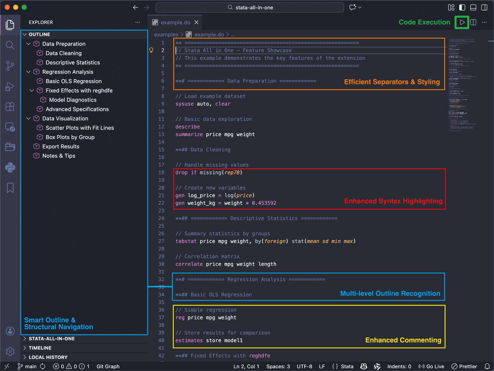

<!-- markdownlint-disable MD001 MD041 MD033 MD029 MD060 MD038 MD032 MD007 -->

   

<h1 align="center">
Stata All in One
</h1>

   One <b>VS Code</b> extension tailored for Stata users

   | <b>Version:</b><a href="https://github.com/ZihaoVistonWang/stata-all-in-one/releases"> 0.2.6</a> | <b>Author:</b> <a href="https://zihaowang.cn">Zihao Viston Wang</a> | <b>翻译:</b>
  <a href="https://gitee.com/ZihaoVistonWang/stata-all-in-one">中文版本</a> |

---

<h3 align="center"><b>All-in-one</b> Stata experience:  Syntax Highlighting + Code Hints + Smart Outline + Code Execution + Quick Editing!</h3>

Stata All in One is derived from <a href="https://github.com/ZihaoVistonWang/stata-outline">Stata Outline</a>.

---

## Features

   

### 1. Enhanced Syntax Highlighting & Code Completion

- **Full Syntax Highlighting and Code Completion Support**: Integrates [Stata Enhanced](https://github.com/kylebarron/language-stata) syntax engine[^1], providing precise syntax highlighting and code completion for `.do` files (under MIT License).
- **Custom Command Highlighting**: Supports highlighting for commonly used third-party commands (e.g., `reghdfe`, `ivreghdfe`, `gtools`), freely configurable in settings.

[^1]: [Stata Enhanced](https://github.com/kylebarron/language-stata) syntax engine was developed by Kyle Barron, providing comprehensive support for the Stata language. This extension follows the MIT License. Thanks to Kyle Barron for his contribution!

### 2. Smart Outline & Structural Navigation

- **Multi-level Outline Recognition**: Automatically detects comment lines from `**#` to `**######` as hierarchical headers, supporting up to **6 levels**.
  - **Shortcuts**: `Ctrl/Cmd + 1-6` to quickly convert to the corresponding header level; `Ctrl/Cmd + 0` to revert to a standard code line.
- **Cursor Auto-Follow**: The outline view automatically highlights and navigates to the corresponding section as the cursor moves in the editor.
  - *Setup: Click the "···" button in the top-right of the Outline view and check "Follow Cursor".*[^2]
- **Multi-level Numbering**: Optional display of logical numbering (e.g., `1.1`, `1.2.1`) within the outline (must be enabled in settings).
- **Auto-Sync Numbering**: When enabled, the extension automatically adds or removes numbering directly within the `.do` file based on the outline structure.

[^2]: Sorry~ This is a VS Code GUI setting, I cannot control it through the extension.

### 3. Code Execution (Stata Interaction)

- **Platform Support**: Seamlessly integrates with Stata on both **macOS** and **Windows** without requiring additional extensions.
- **Multi-Scenario Execution Strategies**:
  - **Smart Current Section Run**: When **no code is selected**, clicking the ▶️ button in the editor title bar or Outline view header, or pressing `Ctrl/Cmd + D`, will automatically detect the current section range and execute all code from the current header to (but not including) the next header of the same or higher level.
  - **Precision Selection Run**: Clicking the ▶️ button or pressing `Ctrl/Cmd + D` to execute the selected code block. Supports **fuzzy selection** - even if you haven't fully covered entire lines, the extension will automatically match and execute the complete selected lines.
- **⚠️ Note**
  - On Windows, code execution relies on PowerShell automation. If your machine is slow or occasionally misses keystrokes, consider increasing the step delay (setting `stata-all-in-one.stataStepDelayOnWindows`).

### 4. Efficient Separator Lines & Styling

- **Quick Insertion**: Supports various symbols to significantly enhance code readability.
  - **Standard Separators**: Use `Ctrl/Cmd + Symbol` to quickly insert separator lines:
    - `Ctrl/Cmd + -` (Dash) | `Ctrl/Cmd + =` (Equal) | `Ctrl/Cmd + Shift + 8` (Asterisk)
  - **Custom Separators**:
    - `Ctrl + Alt + S` (Windows) | `Ctrl + Cmd + S` (macOS), where **S** stands for "**S**eparator".
    - After pressing the shortcut, simply input your desired character to generate the corresponding separator line.
- **Intelligent Wrap Mode**:
  - **Blank Line Insertion**: Generates a full-width separator line (length adjustable in settings).
  - **Non-blank Line Insertion**: Pressing the shortcut once inserts above the line; pressing it again inserts below, creating a "wrapped" effect.
  - **Header Decoration**: Select some characters of a header and press the shortcut to generate a title with balanced decorative symbols (e.g., `**# === Title ===`), without affecting outline recognition.
    - **Centered Header**: If using **Header Decoration** + **Custom *space* separator**, the header content will be automatically centered.

### 5. More Features

1. Enhanced Comments
   - **Toggle Comments**: Quickly toggle line comments using `Ctrl/Cmd + /`.
   - **Optional Styles**: Defaults to `//`, with support for switching to other valid Stata comment delimiters in settings.

2. Built-in Help (Stata Help)

   - **Quick Help**: For example, select `regress` and press the shortcut key `Ctrl/Cmd + Shift + H` to open Stata's `regress` help page.

3. Smart Line Break (Stata Line Break)
   - **One-Key Line Break**: Use `Shift+Enter` to insert Stata line continuation symbol `///` at the cursor position.
   - **Smart Indentation**: Automatically indent by 4 spaces

---

## Keyboard Shortcuts

Click [here](SHORTCUT.md) to view the complete list of keyboard shortcuts.

---

## Installation

### Extension Marketplace

1. Search for "Stata All in One" in VS Code extensions and install.
2. Open any `.do` file and navigate to Outline panel (Explorer → Outline) to view hierarchical structure.

### Manual Installation

1. Download `stata-all-in-one-x.x.x.vsix` from [releases page](https://github.com/ZihaoVistonWang/stata-all-in-one/releases).
2. In VS Code → Extensions panel → `...` → `Install from VSIX...`.
3. Select the downloaded file to complete installation.
4. Open any `.do` file and view Outline panel.

---

## Configuration

Search for "Stata All in One" in VS Code settings and configure:

### Syntax Highlighting and Code Hints

1. **Custom Command Highlighting** (`stata-all-in-one.customCommands`)

   - User-defined Stata commands to highlight as keywords (array of strings). Default: `reghdfe`.
   - Example: `["reghdfe", "ivreghdfe", "gtools", "winsor2", "outreg2"]`
   - **Requires reloading window** after configuration.

### Outline & Navigation

2. **Display Multi-level Numbering** (`stata-all-in-one.numberingShow`)

   - `true`: Outline displays `1.1`, `1.2.1` style numbering.
   - `false` (default): Displays original headings.
3. **Auto-update File Content** (`stata-all-in-one.numberingAdd`)

   - `true`: When numbering is enabled, automatically update section titles in .do files to include numbers. **Requires reopening .do files**
   - `false` (default): Only displays numbering in outline, doesn't modify file.

### Code Execution

4. **Show Run Button** (`stata-all-in-one.showRunButton`)

   - `true` (default): Whether to show the run button in the editor title bar.
   - `false`: Hides button.
5. **Stata Version on macOS** (`stata-all-in-one.stataVersionOnMacOS`)

   - **[macOS]** Stata version. Select between `StataMP`, `StataIC`, `StataSE`.
   - Default: `StataMP`
6. **Stata Path on Windows** (`stata-all-in-one.stataPathOnWindows`)

   - **[Windows]** Path to Stata executable file (e.g., `C:\Program Files\Stata17\StataMP-64.exe`).
7. **Stata Step Delay (Windows)** (`stata-all-in-one.stataStepDelayOnWindows`)

   - **[Windows]** Delay between PowerShell automation steps (ms). Default: `100` (min: `50`). Increase if your machine is slower or Stata misses keystrokes.
8. **Active Stata Window After Running Code** (`stata-all-in-one.activateStataWindow`)

   - `true` (default): Activate the Stata window after running code (bring it to the foreground).
   - `false`: Does not change focus.

### Code Style

9. **Comment Style** (`stata-all-in-one.commentStyle`)

   - `// ` (default): Comment style used for toggling comments. Options include `//`, `*`, or `/* ... */`
10. **Separator Length** (`stata-all-in-one.separatorLength`)

   - Total character length of the separator line (including the '** #' prefix and separators). Default: `60`

11. **Separator Symmetric** (`stata-all-in-one.separatorSymmetric`)

   - `true`: Add ` **` at the end of separator lines to ensure visual symmetry (e.g., `** === title === **`).
   - `false` (default): Separator lines without the suffix.

> **Note**: Changes take effect after reopening `.do` files. When `numberingAdd` is disabled, existing numbering in `.do` files will be automatically removed.

---

## Changelog

| Version     | Changes                                                                                                       | Release Date |
| ----------- | ------------------------------------------------------------------------------------------------------------- | ------------ |
| 0.2.6       | macOS Stata auto-detection (Stata 19+); separator symmetric setting with bulk update command; help shortcut set to Ctrl/Cmd+Shift+H | 2026-01-30   |
| 0.2.5       | Added smart line break feature (Shift+Enter) with auto-indentation and formatting for Stata code              | 2026-01-28   |
| 0.2.4       | Added Stata help functionality; fixed some known issues                                                       | 2026-01-28   |
| 0.2.3       | Integrated Stata Enhanced syntax highlighting; migration prompt and auto-migrated settings from Stata Outline | 2026-01-27   |
| 0.2.2       | Windows native support for executing Stata code                                                               | 2026-01-27   |
| 0.2.0-0.2.1 | macOS native support for executing Stata code; new divider line commands and shortcuts                        | 2026-01-25   |
| 0.1.9       | Outline now follows cursor, highlighting corresponding sections in real-time                                  | 2026-01-24   |
| 0.1.7-0.1.8 | Added toggle comments functionality with customizable comment styles                                          | 2026-01-22   |
| 0.1.5-0.1.6 | Added "Run Current Section" feature                                                                           | 2026-01-12   |
| 0.1.4       | Added multi-level numbering display and auto-update file content                                              | 2026-01-12   |
| 0.1.3       | Fixed display issue with `**#` without spaces                                                               | 2025-12-30   |
| 0.1.2       | Added keyboard shortcut functionality                                                                         | 2025-12-26   |
| 0.1.0-0.1.1 | Initial release matching Stata bookmark style                                                                 | 2025-12-25   |
