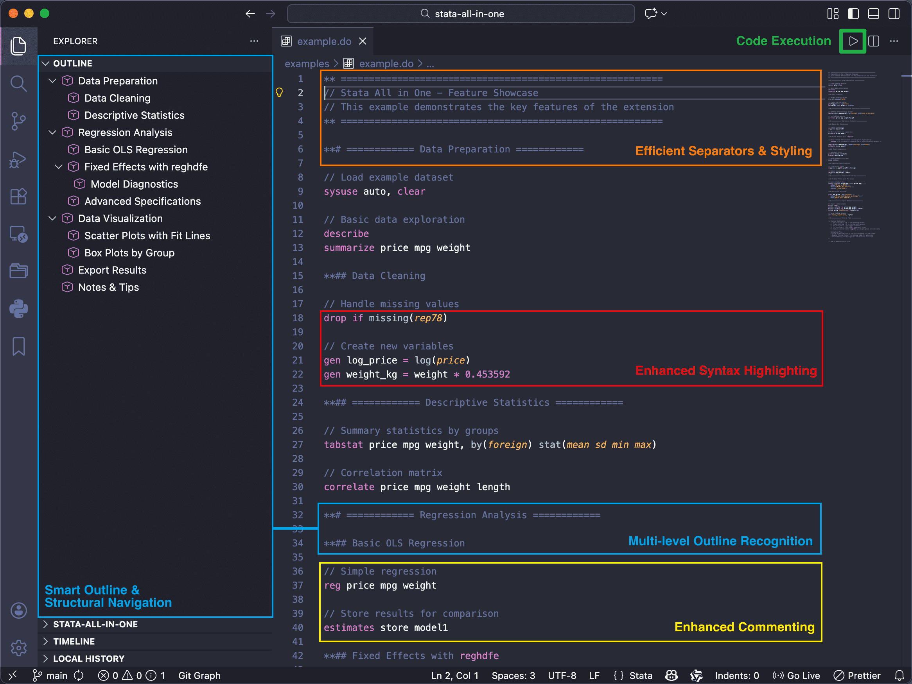

<!-- markdownlint-disable MD001 MD041 MD033 MD029 MD060 MD038 MD032 MD007 -->

   

<h1 align="center">
Stata All in One
</h1>

   One <b>VS Code</b> extension tailored for Stata users

   | <b>Version:</b><a href="https://github.com/ZihaoVistonWang/stata-all-in-one/releases"> 0.2.12</a> | <b>Author:</b> <a href="https://zihaowang.cn">Zihao Viston Wang</a> | <b>翻译:</b>
  <a href="https://gitee.com/ZihaoVistonWang/stata-all-in-one">中文版本</a> |

---

<h3 align="center"><b>All-in-one</b> Stata experience:  Syntax Highlighting + Code Hints + Smart Outline + Code Execution + Quick Editing!</h3>

   
   
   
   

Stata All in One is derived from <a href="https://github.com/ZihaoVistonWang/stata-outline">Stata Outline</a>.

---

## Features

   

### 1. Enhanced Syntax Highlighting & Code Completion

- **Full Syntax Highlighting and Code Completion Support**: Integrates [Stata Enhanced](https://github.com/kylebarron/language-stata) syntax engine[^1], providing precise syntax highlighting and code completion for `.do` files (under MIT License).
- **Custom Command Highlighting**: Supports highlighting for commonly used third-party commands (e.g., `reghdfe`, `ivreghdfe`, `gtools`), freely configurable in settings.

[^1]: [Stata Enhanced](https://github.com/kylebarron/language-stata) syntax engine was developed by Kyle Barron, providing comprehensive support for the Stata language. This extension follows the MIT License. Thanks to Kyle Barron for his contribution!

### 2. Smart Outline & Structural Navigation

- **Multi-level Outline Recognition**: Automatically detects comment lines from `**#` to `**######` as hierarchical headers, supporting up to **6 levels**.
  - **Shortcuts**: `Ctrl/Cmd + 1-6` to quickly convert to the corresponding header level; `Ctrl/Cmd + 0` to revert to a standard code line.
- **Cursor Auto-Follow**: The outline view automatically highlights and navigates to the corresponding section as the cursor moves in the editor.
  - _Setup: Click the "···" button in the top-right of the Outline view and check "Follow Cursor"._[^2]
- **Multi-level Numbering**: Optional display of logical numbering (e.g., `1.1`, `1.2.1`) within the outline (must be enabled in settings).
- **Auto-Sync Numbering**: When enabled, the extension automatically adds or removes numbering directly within the `.do` file based on the outline structure.
- **`program define` Block Recognition**: Displays program names in the outline view for easy navigation and management of custom programs.

[^2]: Sorry~ This is a VS Code GUI setting, I cannot control it through the extension.

### 3. Code Execution (Stata Interaction)

- **Platform Support**: Seamlessly integrates with Stata on both **macOS** and **Windows** without requiring additional extensions.
- **Multi-Scenario Execution Strategies**:
  - **Section Execution**: When the cursor is on a header line (e.g., `** # Title`), clicking the ▶️ button or pressing `Ctrl/Cmd + D` will execute the entire section from that header to the next same-level or higher-level header.
  - **Single Line Execution**: When the cursor is on a regular code line (no selection), clicking the ▶️ button or pressing `Ctrl/Cmd + D` will only execute that specific line.
  - **Selected Code Execution**: When multiple lines of code are selected, clicking the ▶️ button or pressing `Ctrl/Cmd + D` will execute the selected code lines. Supports **fuzzy selection** - no need to precisely select the _first_ or _last_ line of a code segment; the system will automatically capture and run all lines covered by the selection.
- **⚠️ Note**
  
  - On Windows, code execution relies on PowerShell automation. If your machine is slow or occasionally misses keystrokes, consider increasing the step delay (setting `stata-all-in-one.stataStepDelayOnWindows`).
  - On Windows, if Stata does not wake up and run the code when running code, please try to set `true` for the `Close Stata other windows before sending code` option (setting `stata-all-in-one.closeStataOtherWindowsBeforeSendingCode`).

### 4. Efficient Separator Lines & Styling

- **Quick Insertion**: Supports various symbols to significantly enhance code readability.
  - **Standard Separators**: Use `Ctrl/Cmd + Symbol` to quickly insert separator lines:
    - `Ctrl/Cmd + -` (Dash) | `Ctrl/Cmd + =` (Equal) | `Ctrl/Cmd + Shift + 8` (Asterisk)
  - **Custom Separators**:
    - `Ctrl + Alt + S` (Windows) | `Ctrl + Cmd + S` (macOS), where **S** stands for "**S**eparator".
    - After pressing the shortcut, simply input your desired character to generate the corresponding separator line.
- **Intelligent Wrap Mode**:
  - **Blank Line Insertion**: Generates a full-width separator line (length adjustable in settings).
  - **Non-blank Line Insertion**: Pressing the shortcut once inserts above the line; pressing it again inserts below, creating a "wrapped" effect.
  - **Header Decoration**: Select some characters of a header and press the shortcut to generate a title with balanced decorative symbols (e.g., `**# === Title ===`), without affecting outline recognition.
    - **Centered Header**: If using **Header Decoration** + **Custom _space_ separator**, the header content will be automatically centered.

### 5. More Features

1. Enhanced Comments
   - **Toggle Comments**: Quickly toggle line comments using `Ctrl/Cmd + /`.
   - **Optional Styles**: Defaults to `//`, with support for switching to other valid Stata comment delimiters in settings.

2. Built-in Help
   - **Quick Help**: For example, select `regress` and press the shortcut key `Ctrl/Cmd + Shift + H` to open Stata's `regress` help page.

3. Smart Line Break
   - **One-Key Line Break**: Use `Shift+Enter` to insert Stata line continuation symbol `///` at the cursor position.
   - **Smart Indentation**: Automatically indent by 4 spaces

4. Safe Rename Mode
   - **Rename Variable**: Select a variable and press `F2` to rename all occurrences in the current do-file.
   - **Smart Validation**: Automatically validates the new name to ensure it follows Stata naming rules and does not conflict with built-in commands or keywords.
   - **Command Protection**: Intelligently prevents renaming Stata commands (e.g., `reghdfe`, `outreg2`) and their options (e.g., `absorb`, `ctitle`).

5. Auto `cd` to Do File Directory
   - **Auto Working Directory**: When enabled, automatically sets Stata's working directory to the do file's location on first launch.
   - **Disabled by default**: This feature is off by default to avoid unexpected behavior for users who manually write `cd` at the top of their do files. Enable via setting `stata-all-in-one.cdToDoFileDir`.

---

## Keyboard Shortcuts

Click [here](https://github.com/ZihaoVistonWang/stata-all-in-one/blob/main/SHORTCUT.md) to view the complete list of keyboard shortcuts.

---

## Installation

### Extension Marketplace

1. Search for "Stata All in One" in VS Code extensions and install.
2. Open any `.do` file and navigate to Outline panel (Explorer → Outline) to view hierarchical structure.

### Manual Installation

1. Download `stata-all-in-one-x.x.x.vsix` from [releases page](https://github.com/ZihaoVistonWang/stata-all-in-one/releases).
2. In VS Code → Extensions panel → `...` → `Install from VSIX...`.
3. Select the downloaded file to complete installation.
4. Open any `.do` file and view Outline panel.

---

## Configuration

Search for "Stata All in One" in VS Code settings and configure:

### Syntax Highlighting and Code Hints

1. **Custom Command Highlighting** (`stata-all-in-one.customCommands`)
   - User-defined Stata commands to highlight as keywords (array of strings). Default: `reghdfe`.
   - Example: `["reghdfe", "ivreghdfe", "gtools", "winsor2", "outreg2"]`
   - **Requires reloading window** after configuration.

### Outline & Navigation

2. **Display Multi-level Numbering** (`stata-all-in-one.numberingShow`)
   - `true`: Outline displays `1.1`, `1.2.1` style numbering.
   - `false` (default): Displays original headings.

3. **Auto-update File Content** (`stata-all-in-one.numberingAdd`)
   - `true`: When numbering is enabled, automatically update section titles in .do files to include numbers. **Requires reopening .do files**
   - `false` (default): Only displays numbering in outline, doesn't modify file.

### Code Execution

4. **Show Run Button** (`stata-all-in-one.showRunButton`)
   - `true` (default): Whether to show the run button in the editor title bar.
   - `false`: Hides button.

5. **Show Action Buttons** (`stata-all-in-one.showActionButtons`)
   - `true` (default): Show the "Bug report" and "Sponsor" buttons in the editor title bar.
   - `false`: Hide these buttons.

6. **Stata Version on macOS** (`stata-all-in-one.stataVersionOnMacOS`)
   - **[macOS]** Stata version. Select between `StataMP`, `StataIC`, `StataSE`.
   - Default: `StataMP`

7. **Stata Path on Windows** (`stata-all-in-one.stataPathOnWindows`)
   - **[Windows]** Path to Stata executable file (e.g., `C:\Program Files\Stata17\StataMP-64.exe`).

8. **Stata Step Delay (Windows)** (`stata-all-in-one.stataStepDelayOnWindows`)
   - **[Windows]** Delay between PowerShell automation steps (ms). Default: `100` (min: `50`). Increase if your machine is slower or Stata misses keystrokes.

9. **Close Stata Other Windows Before Sending Code (Windows)** (`stata-all-in-one.closeStataOtherWindowsBeforeSendingCode`)
   - **[Windows]** `true`: Close Stata helper windows (such as Viewer/Data Editor) before sending run commands.
   - `false` (default): Keep those windows open and send code directly.

10. **Enable Ctrl+Shift+D for Run Shortcut** (`stata-all-in-one.enableCtrlShiftD`)
   - `true`: Use `Ctrl/Cmd+Shift+D` as the run code shortcut.
   - `false` (default): Use the default `Ctrl/Cmd+D` shortcut.

11. **Auto cd to Do File Directory** (`stata-all-in-one.cdToDoFileDir`)
    - `true`: Automatically `cd` to the do file's directory when Stata is first launched.
    - `false` (default): Stata's working directory is not changed on startup.

### Code Style

12. **Comment Style** (`stata-all-in-one.commentStyle`)
   - `// ` (default): Comment style used for toggling comments. Options include `//`, `*`, or `/* ... */`

13. **Separator Length** (`stata-all-in-one.separatorLength`)

- Total character length of the separator line (including the '\*\* #' prefix and separators). Default: `60`

14. **Separator Symmetric** (`stata-all-in-one.separatorSymmetric`)

- `true`: Add ` **` at the end of separator lines to ensure visual symmetry (e.g., `** === title === **`).
- `false` (default): Separator lines without the suffix.

> **Note**: Changes take effect after reopening `.do` files. When `numberingAdd` is disabled, existing numbering in `.do` files will be automatically removed.

---

## Sponsor

If this extension has been helpful to you, feel free to scan the **Alipay** (left) or **WeChat** (middle) or  (right) QR code below to buy me a coffee ☕

   

---

## Changelog

| Version | Changes                                                                                                              | Release Date |
| ------- | -------------------------------------------------------------------------------------------------------------------- | ------------ |
| 0.2.12  | Windows: Added configurable option to close other Stata windows (Viewer/Data Editor) before sending code; Added configuration to toggle display of "Bug report" and "Sponsor" buttons. | 2026-03-05   |
| 0.2.11  | New optional feature: Auto `cd` to do file directory on first Stata launch (disabled by default).                    | 2026-03-02   |
| 0.2.10  | Refined code execution logic (Section/Line/Selection execution); Configurable run shortcut; F2 rename for variables. | 2026-02-27   |

See [CHANGELOG.md](CHANGELOG.md) for full version history.
