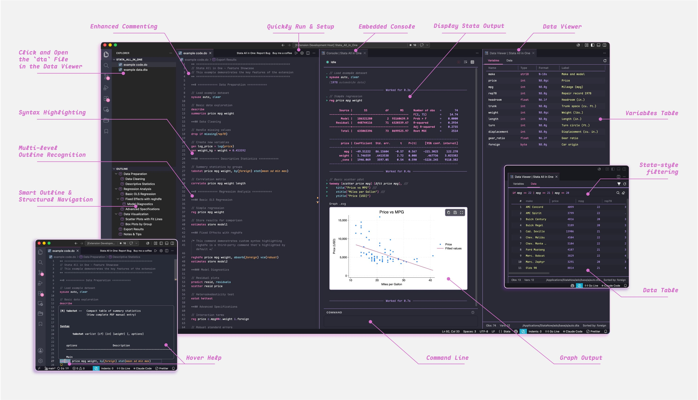

<!-- markdownlint-disable MD001 MD041 MD033 MD029 MD060 MD038 MD032 MD007 MD049-->

   

<h1 align="center">
Stata All in One
</h1>

   One <b>VS Code</b> extension tailored for Stata users

   | <b>Version:</b><a href="https://github.com/ZihaoVistonWang/stata-all-in-one/releases"> 0.2.15</a> | <b>Author:</b> <a href="https://zihaowang.cn">Zihao Viston Wang</a> | <b>Translate:</b>
  <a href="https://gitee.com/ZihaoVistonWang/stata-all-in-one">中文版本</a> |

---

<h3 align="center"><b>All-in-one</b> Stata experience:  Code Execution + Syntax Highlighting + Code Completion + Smart Outline + Data Viewing!</h3>

<h3 align="center"><b>Ready out of the box!</b> Natively integrated into VS Code—no need to configure external environments like Python or Node.js.</h3>

   
   
   
   

Stata All in One is derived from <a href="https://github.com/ZihaoVistonWang/stata-outline">Stata Outline</a>, expanded with new features and improvements.

---

<table style="border-collapse: separate; border-spacing: 0; border-radius: 10px; overflow: hidden; display: block;">
<tr>
<td style="
  background: linear-gradient(135deg, #ff6b6b10, #ffd93d10);
  border: 3px solid #ff6b6b;
  border-radius: 10px;
  padding: 18px 22px;
">

  🚨 <strong>Preview Release Notice</strong> 🚨

  ⚠️ <strong>v0.2.14/0.2.15 is a preview release (pre-release)</strong> and may contain many bugs. It is not recommended for production use. Thank you to everyone willing to try it out and provide feedback!

  📧 If you encounter any issues, please send bug descriptions, reproduction steps, and screenshots to <a href="mailto:hi@zihaowang.cn"><strong>hi@zihaowang.cn</strong></a>.

  🎯 <strong>The stable v0.3.0 is expected in mid-June 2026</strong>, with bug fixes and a more stable experience.

</td>
</tr>
</table>

## Sponsors

Special thanks to RedNote user **Rich\*\*d**, WeChat user **早起\*\*阳光**, and Buy Me a Coffee user **LB\*\*PG@gmail.com** for their generous donations and support for this project.

## Features

   <a href="https://github.com/ZihaoVistonWang/stata-all-in-one/blob/main/img/example-marked-en.jpg"> Click to view full image </a>

### 1. Code Execution (Stata Interaction)

- **Platform Support**: Seamlessly integrates with Stata on both **macOS** and **Windows** without requiring additional extensions.
- **Two Run Modes**:
  - **Embedded Console** (default): Run and display Stata output directly within VS Code! Including *command results*, *error messages*, *command window output*, *data viewing*, and *graph output* — a true all-in-one IDE experience.
  - **External App**: Continue using the traditional approach of sending code to the Stata GUI, for users who prefer Stata's native interface. Windows now uses [Stata COM Automation](https://www.stata.com/automation/), delivering significantly better performance than the previous PowerShell-based implementation.
- **Multi-Scenario Execution Strategies**:
  - **Section Execution**: When the cursor is on a header line (e.g., `** # Title`), click the ▶️ button or press `Ctrl/Cmd + D` to execute all code from that header to the next same-level or higher-level header (i.e., the entire section).
  - **Single Line Execution**: When the cursor is on a regular code line (no selection), click the ▶️ button or press `Ctrl/Cmd + D` to execute only that specific line.
  - **Selected Code Execution**: When multiple lines are selected, click the ▶️ button or press `Ctrl/Cmd + D` to execute the selected lines. Supports **fuzzy selection** — no need to precisely select the *first* or *last* line of a code segment; the system automatically captures and runs all lines covered by the selection.

### 2. Enhanced Syntax Highlighting & Code Completion

- **Full Syntax Highlighting and Code Completion Support**: Integrates [Stata Enhanced](https://github.com/kylebarron/language-stata) syntax engine[^1], providing precise syntax highlighting and code completion for `.do` files (under [MIT](https://github.com/ZihaoVistonWang/stata-all-in-one/blob/main/THIRD_PARTY_NOTICES.md) License).
- **Custom Command Highlighting**: Supports highlighting for commonly used third-party commands (e.g., `reghdfe`, `ivreghdfe`, `gtools`), freely configurable in settings.
- **Dataset Variable Autocompletion**: (After running code once) Provides intelligent autocomplete suggestions based on the current dataset when typing variable names in the editor and console, boosting coding efficiency.

[^1]: [Stata Enhanced](https://github.com/kylebarron/language-stata) syntax engine was developed by Kyle Barron, providing comprehensive support for the Stata language. This extension follows the [MIT](https://github.com/ZihaoVistonWang/stata-all-in-one/blob/main/THIRD_PARTY_NOTICES.md) License. Thanks to Kyle Barron for his contribution!

### 3. Smart Outline & Structural Navigation

- **Multi-level Outline Recognition**: Automatically detects comment lines from `**#` to `**######` as hierarchical headers, supporting up to _6 levels_.
  - **Shortcuts**: `Ctrl/Cmd + 1-6` to quickly convert to the corresponding header level; `Ctrl/Cmd + 0` to revert to a standard code line.
- **Cursor Auto-Follow**: The outline view automatically highlights and navigates to the corresponding section as the cursor moves in the editor.
  - _Setup: Click the "···" button in the top-right of the Outline view and check "Follow Cursor"._[^2]
- **Multi-level Numbering**: Optional display of logical numbering (e.g., `1.1`, `1.2.1`) within the outline (must be enabled in settings).
- **Auto-Sync Numbering**: When enabled, the extension automatically adds or removes numbering directly within the `.do` file based on the outline structure.
- **`program define` Block Recognition**: Displays program names in the outline view for easy navigation and management of custom programs.

[^2]: Sorry~ This is a VS Code GUI setting, I cannot control it through the extension.

### 4. Data Viewer

- **Click to View**: Click a `.dta` file in the VS Code Explorer to open it in the new `Data Viewer` panel.
  - **Variable Info**: Variable table displays metadata such as name, label, and type.
  - **Data Browsing**: Supports lazy loading of rows and columns — easily browse large datasets right in VS Code without opening Stata.
- **View After Run**: After running code in `Embedded Console` mode, instantly view results in the `Data Viewer` within the `Console` panel.
- **Data Filtering**: Provides Stata-style filtering for quickly locating subsets of data.

### 5. Efficient Separator Lines & Styling

- **Quick Insertion**: Supports various symbols to significantly enhance code readability.
  - **Standard Separators**: Use `Ctrl/Cmd + Symbol` to quickly insert separator lines:
    - `Ctrl/Cmd + -` (Dash) | `Ctrl/Cmd + =` (Equal) | `Ctrl/Cmd + Shift + 8` (Asterisk)
  - **Custom Separators**:
    - `Ctrl + Alt + S` (Windows) | `Ctrl + Cmd + S` (macOS), where **S** stands for "**S**eparator".
    - After pressing the shortcut, simply input your desired character to generate the corresponding separator line.
- **Intelligent Wrap Mode**:
  - **Blank Line Insertion**: Generates a full-width separator line (length adjustable in settings).
  - **Non-blank Line Insertion**: Pressing the shortcut once inserts above the line; pressing it again inserts below, creating a "wrapped" effect.
  - **Header Decoration**: Select some characters of a header and press the shortcut to generate a title with balanced decorative symbols (e.g., `**# === Title ===`), without affecting outline recognition.
    - **Centered Header**: If using **Header Decoration** + **Custom _space_ separator**, the header content will be automatically centered.

### 6. More Features

1. Enhanced Embedded Console
   - **Graph Output**
     - **Direct Display**: Render Stata graph output directly in the embedded console.
     - **Export Options**: Save graphs as SVG, PNG (configurable DPI), or copy to clipboard.
     - **Fullscreen View**: Click a graph to view it in fullscreen mode for detailed inspection.

   - **Progress Display**
     - **Command Execution Status**: For commands like `bootstrap`, the console shows execution progress and status. Other commands display elapsed time to help you monitor their state.

   - **Custom Font**:
     - **Font Settings**: Use `stata-all-in-one.consoleFontMode` and `stata-all-in-one.consoleCustomFontFamily` to customize the console font for a better reading experience.

2. Enhanced Comments
   - **Toggle Comments**: Quickly toggle line comments using `Ctrl/Cmd + /`.
   - **Optional Styles**: Defaults to `//`, with support for switching to other valid Stata comment delimiters in settings.

3. Built-in Help
   - **Show Help Text**: For example, select `regress` and press `Ctrl/Cmd + Shift + H`. In External App mode, this opens Stata's `regress` help page; in Embedded Console mode, the help text is displayed directly in the console.
   - **Hover Help**: Hover over a Stata command to see help information, with automatic filtering of non-practical commands like `#delimit`, `using`, etc.

4. Smart Line Break
   - **One-Key Line Break**: Use `Shift+Enter` to insert Stata line continuation symbol `///` at the cursor position.
   - **Smart Indentation**: Automatically indent by 4 spaces

5. Safe Rename Mode
   - **Rename Variable**: Select a variable and press `F2` to rename all occurrences in the current document.
   - **Smart Validation**: Automatically validates the new name to ensure it follows Stata naming rules and does not conflict with built-in commands or keywords.
   - **Command Protection**: Intelligently prevents renaming Stata commands (e.g., `reghdfe`, `outreg2`) and their options (e.g., `absorb`, `ctitle`).

6. Auto `cd` to Do File Directory
   - **Auto Working Directory**: When enabled, automatically sets Stata's working directory to the do file's location on first launch.
   <!-- - **Disabled by default**: This feature is off by default to avoid unexpected behavior for users who manually write `cd` at the top of their do files. Enable via setting `stata-all-in-one.cdToDoFileDir`. -->

7. Quick Settings
   - **Settings Button**: Click the gear icon in the editor title bar to quickly access Stata All in One settings.

---

## Keyboard Shortcuts

Click [here](https://github.com/ZihaoVistonWang/stata-all-in-one/blob/main/SHORTCUT.md) to view the complete list of keyboard shortcuts.

---

## Installation

### Install from Extension Marketplace

- **VS Code**: Search for "Stata All in One" in extensions and install.

### Download and Install (for Cursor, Trae and other VSCode-based IDEs)

1. Download `stata-all-in-one-x.x.x.vsix` from either source:
   - [Open VSX Registry](https://open-vsx.org/extension/ZihaoVistonWang/stata-all-in-one)
   - [GitHub Releases Page](https://github.com/ZihaoVistonWang/stata-all-in-one/releases)
2. Open Extensions panel in your editor → `...` → `Install from VSIX...`.
3. Select the downloaded `.vsix` file to complete installation.

---

## Configuration

Search for "Stata All in One" in VS Code settings and configure:

### Code Execution

1. **Run Mode** (`stata-all-in-one.runMode`)
   - `embeddedConsole` (default): Run code in the built-in **Console | Stata All in One** panel within VS Code, with direct output viewing and interaction.
   - `externalApp`: Send code to the system-installed Stata application for execution.

2. **Stata Version on macOS** (`stata-all-in-one.stataVersionOnMacOS`)
   - Stata runtime version. Choose from `StataMP`, `StataSE`, `StataIC`, or `StataBE`.

3. **Stata Path on Windows** (`stata-all-in-one.stataPathOnWindows`)
   - Path to Stata executable file (e.g., `C:\Program Files\Stata17\StataMP-64.exe`).

4. **Close Stata Other Windows Before Sending Code (Windows)** (`stata-all-in-one.closeStataOtherWindowsBeforeSendingCode`)
   - `true`: Close Stata helper windows (such as Viewer/Data Editor) before sending run commands.
   - `false` (default): Keep those windows open and send code directly.

5. **Auto cd to Do File Directory** (`stata-all-in-one.cdToDoFileDir`)
   - `true` (default): Automatically set Stata's working directory to the do file's location on first launch.
   - `false`: Stata's working directory is not changed on startup.

6. **Show Run Button** (`stata-all-in-one.showRunButton`)
   - `true` (default): Show the run button in the editor title bar.
   - `false`: Hide the button.

7. **Show Action Buttons** (`stata-all-in-one.showActionButtons`)
   - `true` (default): Show the "Bug Report" and "Sponsor" buttons in the editor title bar.
   - `false`: Hide these buttons.

8. **Enable Ctrl+Shift+D for Run Shortcut** (`stata-all-in-one.enableCtrlShiftD`)
   - `true`: Use `Ctrl/Cmd+Shift+D` as the run code shortcut.
   - `false` (default): Use the default `Ctrl/Cmd+D` shortcut.

### Embedded Console

9. **Console Font Mode** (`stata-all-in-one.consoleFontMode`)
   - `editor` (default): Follow the editor font, falling back to the system monospace font.
   - `system`: Use the system monospace font directly.
   - `custom`: Use the custom font specified below.

10. **Console Custom Font Family** (`stata-all-in-one.consoleCustomFontFamily`)
    - When font mode is set to `custom`, the CSS `font-family` list used by the console.
    - Example: `"Maple Mono NF CN", Menlo, Monaco, monospace`

11. **Graph Export DPI** (`stata-all-in-one.graphPngDpi`)
    - DPI value for saving embedded console graphs as PNG. Default `600`, range 72–1200.

### Syntax Highlighting and Code Completion

12. **Custom Command Highlighting** (`stata-all-in-one.customCommands`)
    - User-defined Stata commands to highlight as keywords (array of strings). Default: `reghdfe`.
    - Example: `["reghdfe", "ivreghdfe", "gtools", "winsor2", "outreg2"]`
    - **Requires reloading window** after configuration.

### Hover Help

13. **Enable Hover Docs** (`stata-all-in-one.enableHoverDocs`)
    - `true` (default): Show official Stata help information when hovering over Stata commands.
    - `false`: Disable hover help.

14. **Additional ADO Paths** (`stata-all-in-one.additionalAdoPaths`)
    - Extra Stata ADO paths for scanning help files of community-contributed commands.
    - Example: `["/Users/username/ado/personal", "C:\\Users\\username\\ado\\personal"]`

### Outline & Navigation

15. **Display Multi-level Numbering** (`stata-all-in-one.numberingShow`)
    - `true`: Outline displays `1.1`, `1.2.1` style numbering.
    - `false` (default): Displays original headings.

16. **Auto-update Heading Numbering** (`stata-all-in-one.numberingAdd`)
    - `true`: **When numbering is enabled**, automatically update section titles in `.do` files to include numbers.
    - `false` (default): Only displays numbering in outline, doesn't modify file.

### Code Style

17. **Comment Style** (`stata-all-in-one.commentStyle`)
    - `// ` (default): Comment style used for toggling comments. Options include `//`, `*`, or `/* ... */`

18. **Separator Length** (`stata-all-in-one.separatorLength`)
    - Total character length of the separator line (including the `** #` prefix and separators). Default: `60`

19. **Separator Symmetric** (`stata-all-in-one.separatorSymmetric`)
    - `true`: Add ` **` at the end of separator lines to ensure visual symmetry (e.g., `** === Title === **`).
    - `false` (default): Separator lines without the suffix.

> **Note**: Changes to `numberingShow`, `numberingAdd`, and `customCommands` require reopening `.do` files to take effect. When `numberingAdd` is disabled, existing numbering in `.do` files will be automatically removed.

---

## Buy me a coffee

If this extension has been helpful to you, feel free to scan the **Alipay** (left), **WeChat** (middle), or [**Buy Me a Coffee**](https://www.buymeacoffee.com/zihaovistonwang) (right) QR code below to support ☕

   

---

## Changelog

| Version | Changes                                                                                                              | Release Date |
| ------- | -------------------------------------------------------------------------------------------------------------------- | ------------ |
| 0.2.15/0.2.14  | Preview release: Introduced Embedded Console, Data Viewer, and Graph Support; improved Hover help display; bug fixes | 2026-05-31   |
| 0.2.13  | On Windows, running code no longer restores a snapped or maximized Stata window to a smaller size — preserves current window state | 2026-03-12   |
| 0.2.12  | Refactored Windows code execution logic; Added option to close other Stata windows before sending code; Added toggle for "Bug Report" and "Sponsor" buttons | 2026-03-05   |
| 0.2.11  | New optional feature: Auto `cd` to do file directory on first Stata launch (disabled by default)                     | 2026-03-02   |
| 0.2.10  | Refined code execution logic (Section/Line/Selection execution); Configurable run shortcut; F2 rename for variables  | 2026-02-27   |

See [CHANGELOG.md](CHANGELOG.md) for full version history.
