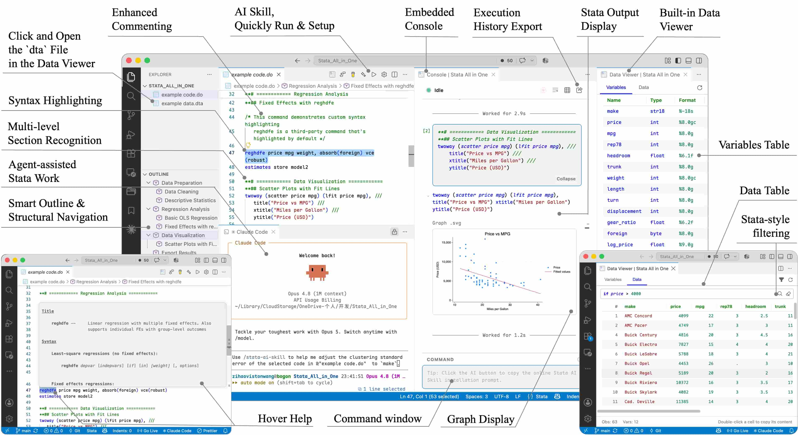

<!-- markdownlint-disable MD001 MD041 MD033 MD029 MD060 MD038 MD032 MD007 MD049-->

   

<h1 align="center">
Stata All in One
</h1>

   An integrated Stata productivity environment in VS Code

   | <b>Version:</b><a href="https://github.com/ZihaoVistonWang/stata-all-in-one/releases"> 0.3.12</a> | <b>Author:</b> <a href="https://zihaowang.cn">Zihao Viston Wang</a> | <b>Translate:</b>
  <a href="https://gitee.com/ZihaoVistonWang/stata-all-in-one">中文版本</a> |

---

<h3 align="center"><b>All-in-one</b> Stata experience:  Code Execution + Syntax Highlighting + Code Completion + Smart Outline + Data Viewing + AI Skill!</h3>

<h3 align="center"><b>Ready out of the box!</b> Natively integrated into VS Code—no need to configure external environments like Python or Node.js.</h3>

   
   
   
   
   

Stata All in One is derived from <a href="https://github.com/ZihaoVistonWang/stata-outline">Stata Outline</a>, expanded with new features and improvements.

This README provides technical documentation and installation/configuration instructions for Stata All in One. For a more accessible feature overview, visit my <a href="https://zihaowang.cn/en/post/stata-all-in-one-news/">blog</a> to learn more.

---

## Acknowledgments

- First, my thanks go to RedNote user **Rich\*\*d**, WeChat users **M\*k\***, **柿\*\*橙**, **X\*\*n**, and the anonymous user who commented “功能强大且配置简单的插件，谢谢！”, and Buy Me a Coffee supporters **LB\*\*PG@gmail.com** and **ol\*\*\*ba@gmail.com** for their generous contributions and continued support of this project.
- Above all, I am deeply grateful to the **Agricultural Economics and Management Innovation Team** at Northwest A&F University for supporting my research, providing funding, and helping [promote and publicize](https://mp.weixin.qq.com/s/kxSfIF2nu1LuUzC2NvKWog) this project.
- I am also sincerely grateful to **Assoc. Prof. [Yujun Lian](https://lingnan.sysu.edu.cn/faculty/lianyujun)** and the **[lianxh.cn](https://www.lianxh.cn/) team** for their patient guidance and [publicity support](https://www.lianxh.cn/details/1865.html).
- Finally, I thank Stata's officially authorized distributor [**Beijing Uone Info&Tech Co.,Ltd (Uone-Tech)**](http://www.uone-tech.cn/) for its support in [promoting and publicizing](https://mp.weixin.qq.com/s/UhLmoGK4VhYULACagjbcTg) this project.

## Features

   <a href="https://github.com/ZihaoVistonWang/stata-all-in-one/blob/main/img/example-marked-en.jpg"> Click to view full image </a>

> ⚠️ Features marked with 🛠️ require **Stata 17 or later** and a `STATA.LIC` license file. Please support genuine Stata software to enjoy the full experience. You can contact Stata Corp, LLC's officially authorized partner [Beijing Uone Info&amp;Tech Co.,Ltd (Uone-Tech)](http://www.uone-tech.cn/Stata.html) to purchase genuine Stata software or request a trial.

### 1. Stata AI Skill 🛠️

- **Let AI Agents Run Stata Code**: Install the standalone native `stata-ai-skill` so AI coding tools (Claude Code, Cursor, Codex CLI, Open Code, OpenClaw, etc.) can run Stata through a Rust background service.
- **Native Local Service**: Once installed, the AI Skill runs through its native executable and local service, with no third-party environment such as Python or Node.js required.
- **Leave the setup to AI**: Click the `AI` button in the editor toolbar, copy the prompt, and paste it into your AI tool. The prompt links to the online `installation.md` through Gitee and GitHub.

### 2. Code Execution (Interacting with Stata)

- **Platform Support**: This extension natively supports seamless integration with Stata on both **macOS** and **Windows**.
- **Two Run Modes**:
  - **Embedded Console** (default) 🛠️: Run and display Stata output directly within VS Code, including *command results*, *error messages*, *command window output*, and *graph output*, for a true one-stop experience. Click any file path shown in the Console output to open it.
  - **External App**: Continue using the traditional approach of sending code to the Stata GUI, for users who prefer Stata's native interface. Windows now uses [Stata COM Automation](https://www.stata.com/automation/), delivering significantly better performance than the previous PowerShell-based implementation.
- **Multi-Scenario Execution Strategies**:
  - **Section Execution**: When the cursor is on a header line (e.g., `** # Title`), click the ▶️ button or press `Ctrl / ⌘ + D` to execute all code from that header to the next same-level or higher-level header (i.e., the entire section).
  - **Single Line Execution**: When the cursor is anywhere on a regular code line, click the ▶️ button or press `Ctrl / ⌘ + D` to execute only the current line.
  - **Selected Code Execution**: When one or multiple lines are selected, click the ▶️ button or press `Ctrl / ⌘ + D` to execute the selected lines. Supports **fuzzy selection** — no need to precisely select the *first* or *last* line of a code segment; the system automatically captures and runs all lines covered by the selection.

### 3. Enhanced Syntax Highlighting & Code Completion

- **Full Syntax Highlighting and Code Completion Support**: Integrates [Stata Enhanced](https://github.com/kylebarron/language-stata) syntax engine[^1], providing precise syntax highlighting and code completion for `.do` files (under [MIT](https://github.com/ZihaoVistonWang/stata-all-in-one/blob/main/THIRD_PARTY_NOTICES.md) License).
- **Custom Command Highlighting**: Supports highlighting for commonly used third-party commands (e.g., `reghdfe`, `ivreghdfe`, `gtools`), freely configurable in settings.
- **Smart Variable Completion**: (After loading a dataset) The editor, Console, and Data Viewer support fuzzy matching and highlighting by variable name, label, Chinese text, and pinyin.

[^1]: [Stata Enhanced](https://github.com/kylebarron/language-stata) syntax engine was developed by Kyle Barron, providing comprehensive support for the Stata language. This extension follows the [MIT](https://github.com/ZihaoVistonWang/stata-all-in-one/blob/main/THIRD_PARTY_NOTICES.md) License. Thanks to Kyle Barron for his contribution!
    
### 4. Smart Outline & Structural Navigation

- **Multi-level Outline Recognition**: Automatically detects comment lines from `**#` to `**######` as hierarchical headers, supporting up to _6 levels_.
  - **Shortcuts**: `Ctrl / ⌘ + 1-6` to quickly convert to the corresponding header level; `Ctrl / ⌘ + 0` to revert to a standard code line.
- **Cursor Auto-Follow**: The outline view automatically highlights and navigates to the corresponding section as the cursor moves in the editor.
  - _Setup: Click the "···" button in the top-right of the Outline view and check "Follow Cursor"._[^2]
- **Multi-level Numbering**: Optional display of logical numbering (e.g., `1.1`, `1.2.1`) within the outline (must be enabled in settings).
- **Auto-Sync Numbering**: When enabled, the extension automatically adds or removes numbering directly within the `.do` file based on the outline structure.
- **`program define` Block Recognition**: Displays program names in the outline view for easy navigation and management of custom programs.

[^2]: Sorry~ This is a VS Code GUI setting, I cannot control it through the extension.
    
### 5. Data Viewer 🛠️

- **Click to View**: Click a `.dta` file in the VS Code Explorer to open it in the new `Data Viewer` panel.
  - **Variable Info**: Variable table displays metadata such as name, label, and type.
  - **Data Browsing**: Supports lazy loading of rows and columns — easily browse large datasets right in VS Code without opening Stata.
- **View After Run**: After running code, instantly view results in the `Data Viewer` within the `Console` panel.
- **Data Filtering**: Provides Stata-style filtering for quickly locating subsets of data.
- **Handy Extras**:
  - **Built-in `br` / `browse`**: In Embedded Console mode, run `br` / `browse` with Stata filtering expressions from either the code editor or Console input to open the built-in Data Viewer.
  - **View Long Text**: If a cell contains more text than it can display, hover over the cell to view the full content.
  - **Double-click to Copy**: Double-click a cell to copy its full content to the clipboard.

### 6. Efficient Separator Lines & Styling

- **Quick Insertion**: Supports various symbols to significantly enhance code readability.
  - **Standard Separators**: Use `Ctrl / ⌘ + Symbol` to quickly insert separator lines:
    - `Ctrl / ⌘ + -` (Dash) | `Ctrl / ⌘ + =` (Equal) | `Ctrl / ⌘ + Shift + 8` (Asterisk)
  - **Custom Separators**:
    - `Ctrl + Alt + S` (Windows) | `Ctrl + ⌘ + S` (macOS), where **S** stands for "**S**eparator".
    - After pressing the shortcut, simply input your desired character to generate the corresponding separator line.
- **Intelligent Wrap Mode**:
  - **Blank Line Insertion**: Generates a full-width separator line (length adjustable in settings).
  - **Non-blank Line Insertion**: Pressing the shortcut once inserts above the line; pressing it again inserts below, creating a "wrapped" effect.
  - **Header Decoration**: Select some characters of a header and press the shortcut to generate a title with balanced decorative symbols (e.g., `**# === Title ===`), without affecting outline recognition.
    - **Centered Header**: If using **Header Decoration** + **Custom _space_ separator**, the header content will be automatically centered.

### 7. More Features

1. Enhanced Embedded Console 🛠️

   - **Graph Output**

     - **Direct Display**: Render Stata graph output directly in the embedded console.
     - **Export Options**: Save graphs as SVG, PNG (configurable DPI), or copy to clipboard.
     - **Floating Preview**: Click a graph to view it in a floating window.
   - **Progress Display**

     - **Command Execution Status**: For long-running commands like `bootstrap`, `bdiff`, and `xthreg`, the console shows real-time progress (e.g. 50/2000) and estimated time remaining. Other commands display elapsed time.
   - **Custom Font**:

     - **Online (Default)**: Load Maple Mono for Latin text and Maple Mono NF CN for Chinese text.
     - **Font Settings**: Use `stata-all-in-one.consoleFontMode` and `stata-all-in-one.consoleCustomFontFamily` to customize the console font for a better reading experience.
     - **Shared Font Size**: The Console and Data Viewer share a font size and can follow the editor setting.
   - **Run Presentation**

     - **Grouped Display**: Show each run as a collapsible input cell with clearly grouped command echoes and results.
     - **Collapsible Input**: Collapse the command input to its title bar.
     - **Quick Navigation**: Quickly locate output using the Embedded Console's right-side navigation and jump-to-bottom button.
   - **Large Output & Run Control**

     - **Responsive Browsing**: Page large output while preserving complete history.
     - **Reliable Stop**: Stop or Esc first attempts a soft interrupt, then force-terminates and automatically rebuilds an unresponsive Stata session.
     - **Stable Status**: Keep elapsed time accurate across view changes and avoid duplicate temporary do-file input.
   - **Result Management**

     - **Complete Exports**: Preserve the entire Console history when exporting results to HTML, Markdown, or Notebook.
     - **Consistent Layout**: Keep command grouping aligned across HTML, Markdown, and Notebook; HTML also provides code previews, continuous navigation, aligned numbering, and horizontal-scroll cues.
     - **Wide Result Preview**: View horizontally overflowing results in a floating window.
     - **Reliable File Links**: Recognize and validate file and directory paths in results, including Chinese, multi-line, and repeated paths, and open them with one click.
   - **Data Viewer Integration**

     - **On-demand Refresh**: After data changes, click the already-open Data Viewer tab again to refresh it and restore the previous viewport.
2. Enhanced Comments

   - **Toggle Comments**: Quickly toggle line comments using `Ctrl / ⌘ + /`.
   - **Optional Styles**: Defaults to `//`, with support for switching to other valid Stata comment delimiters in settings.
3. Built-in Help

   - **Hover Help**: Hover over a Stata command to see help information, with automatic filtering of non-practical commands like `#delimit`, `using`, etc.
   - **Show Help Text**: For example, select `regress` and press `Ctrl / ⌘ + Shift + H`. In External App mode, this opens Stata's `regress` help page; in Embedded Console mode, the help text is displayed directly in the console.
4. Smart Line Break

   - **One-Key Line Break**: Use `Shift + Enter` to insert Stata line continuation symbol `///` at the cursor position.
   - **Smart Indentation**: Automatically indent by 4 spaces
5. Convenient Editor Context Menus

   - **Smart Run Actions**: Show “Run Current Section,” “Run Current Line,” or “Run Selected Lines” based on the cursor and selection, with the matching shortcut hint.
   - **Quick Editing**: Right-click to set heading levels, insert separators, center heading text, or quickly comment using the configured style.
   - **AI Skill**: Open Stata AI Skill from the context menu when a usable Stata license is detected.
6. Safe Rename Mode

   - **Rename Variable**: Select a variable and press `F2` to rename all occurrences in the current document.
   - **Smart Validation**: Automatically validates the new name to ensure it follows Stata naming rules and does not conflict with built-in commands or keywords.
   - **Command Protection**: Intelligently prevents renaming Stata commands (e.g., `reghdfe`, `outreg2`) and their options (e.g., `absorb`, `ctitle`).
7. Auto `cd` to Do File Directory

   - **Auto Working Directory**: When enabled, automatically sets Stata's working directory to the do file's location on first launch.

   <!-- - **Disabled by default**: This feature is off by default to avoid unexpected behavior for users who manually write `cd` at the top of their do files. Enable via setting `stata-all-in-one.cdToDoFileDir`. -->
8. Quick Settings

   - **Settings Button**: Click the gear icon in the editor title bar to quickly access Stata All in One settings.

---

## Keyboard Shortcuts

Click [here](https://github.com/ZihaoVistonWang/stata-all-in-one/blob/main/SHORTCUT.md) to view the complete list of keyboard shortcuts.

---

## Installation

### Install from Extension Marketplace

- **VS Code**: Search for "Stata All in One" in extensions and install.

### Download and Install (for Cursor, Trae and other VSCode-based IDEs)

1. Download `stata-all-in-one-x.x.x.vsix` from either source:
   - [Open VSX Registry](https://open-vsx.org/extension/ZihaoVistonWang/stata-all-in-one)
   - [GitHub Releases Page](https://github.com/ZihaoVistonWang/stata-all-in-one/releases)
2. Open Extensions panel in your editor → `...` → `Install from VSIX...`.
3. Select the downloaded `.vsix` file to complete installation.

---

## Configuration

Search for "Stata All in One" in VS Code settings and configure:

### AI Skill

Click the `AI` button in the Stata editor toolbar to copy a prompt containing Gitee and GitHub links to the online `installation.md`. After installation, your AI coding tool follows the installed Skill's `SKILL.md` for service startup, status checks, Stata configuration, and subsequent operations.

### Configure from Stata

If automatic discovery cannot find Stata, choose `Stata not found? Configure it directly from Stata`. Follow the extension's two prompted steps and run each command in Stata to complete the setup.

### Code Execution

1. **Run Mode** (`stata-all-in-one.runMode`)

   - `embeddedConsole` (default): Run code in the built-in **Console | Stata All in One** panel within VS Code, with direct output viewing and interaction.
   - `externalApp`: Send code to the system-installed Stata application for execution.
2. **Stata Version on macOS** (`stata-all-in-one.stataVersionOnMacOS`)

   - Stata runtime version. When empty, the extension detects installed versions at startup for up to 3 seconds, preferring the highest numeric version and then `StataMP`, `StataSE`, `StataBE`, and `StataIC`. If detection fails, configure directly from the running Stata instance. The initializer then verifies the exact `.app`, Console dylib, and `stata.lic`, initializes the Embedded Console when possible, and reports the result once in a central dialog.
3. **Stata Path on Windows** (`stata-all-in-one.stataPathOnWindows`)

   - Path to Stata executable file (e.g., `C:\Program Files\Stata17\StataMP-64.exe`). When empty, the extension runs the bundled `scripts/discover_stata_windows.bat` registry probe at startup for up to 5 seconds. The same BAT can be run independently to generate `stata-discovery-report.json` for troubleshooting. If detection fails, configure directly from the running Stata instance. The initializer then verifies the EXE, Console DLL, and `stata.lic`, initializes the Embedded Console when possible, and reports the result once in a central dialog.
4. **Close Stata Other Windows Before Sending Code (Windows)** (`stata-all-in-one.closeStataOtherWindowsBeforeSendingCode`)

   - `true`: Close Stata helper windows (such as Viewer/Data Editor) before sending run commands.
   - `false` (default): Keep those windows open and send code directly.
5. **Auto cd to Do File Directory** (`stata-all-in-one.cdToDoFileDir`)

   - `true` (default): Automatically set Stata's working directory to the do file's location on first launch.
   - `false`: Stata's working directory is not changed on startup.
6. **Show Action Buttons** (`stata-all-in-one.showActionButtons`)

   - `true` (default): Show the "Bug Report" and "Stata AI Skill" buttons in the editor title bar.
   - `false`: Hide both buttons.
7. **Show Sponsor Button** (`stata-all-in-one.showSponsorButton`)

   - `true`: Show the "Sponsor" button in the Stata editor title bar.
   - `false` (default): Hide the button.
8. **Enable Ctrl+Shift+D for Run Shortcut** (`stata-all-in-one.enableCtrlShiftD`)

   - `true`: Use `Ctrl / ⌘ + Shift + D` as the run code shortcut.
   - `false` (default): Use the default `Ctrl / ⌘ + D` shortcut.

### Embedded Console

11. **Console Font Mode** (`stata-all-in-one.consoleFontMode`)
    - `online` (default): Load Maple Mono for Latin text and Maple Mono NF CN for Chinese text.[^3]
    - `editor`: Follow the editor font, falling back to the system monospace font.
    - `system`: Use the system monospace font directly.
    - `custom`: Use the custom font specified below.

[^3]: Font credits: [subframe7536/maple-font](https://github.com/subframe7536/maple-font), [fontsource](https://fontsource.org/fonts/maple-mono), and ZeoSeven Fonts ([443](https://fonts.zeoseven.com/items/443/), [442](https://fonts.zeoseven.com/items/442/)).
    
12. **Console Custom Font Family** (`stata-all-in-one.consoleCustomFontFamily`)

    - When font mode is set to `custom`, the CSS `font-family` list used by the console.
    - Example: `"Maple Mono NF CN", Menlo, Monaco, monospace`
13. **Console and Data Viewer Font Size** (`stata-all-in-one.consoleAndDataViewerFontSize`)

    - Follows the VS Code editor font size when empty.
14. **Graph Export DPI** (`stata-all-in-one.graphPngDpi`)

    - DPI value for saving embedded console graphs as PNG. Default `600`, range 72–1200.

### Syntax Highlighting and Code Completion

15. **Custom Command Highlighting** (`stata-all-in-one.customCommands`)
    - User-defined Stata commands to highlight as keywords (array of strings). Default: `reghdfe`.
    - Example: `["reghdfe", "ivreghdfe", "gtools", "winsor2", "outreg2"]`
    - **Requires reloading window** after configuration.
16. **Pinyin Variable Matching** (`stata-all-in-one.enablePinyinVariableMatching`)

    - `true` (default): Enable pinyin fuzzy matching for variable names and labels.

### Hover Help

17. **Enable Hover Docs** (`stata-all-in-one.enableHoverDocs`)

    - `true` (default): Show official Stata help information when hovering over Stata commands.
    - `false`: Disable hover help.
18. **Additional ADO Paths** (`stata-all-in-one.additionalAdoPaths`)

    - Extra Stata ADO paths for scanning help files of community-contributed commands.
    - Example: `["/Users/username/ado/personal", "C:\\Users\\username\\ado\\personal"]`

### Outline & Navigation

19. **Display Multi-level Numbering** (`stata-all-in-one.numberingShow`)

    - `true`: Outline displays `1.1`, `1.2.1` style numbering.
    - `false` (default): Displays original headings.
20. **Auto-update Heading Numbering** (`stata-all-in-one.numberingAdd`)

    - `true`: **When numbering is enabled**, automatically update section titles in `.do` files to include numbers.
    - `false` (default): Only displays numbering in outline, doesn't modify file.

> **Note**: Changes to `numberingShow`, `numberingAdd`, and `customCommands` require reopening `.do` files to take effect. When `numberingAdd` is disabled, existing numbering in `.do` files will be automatically removed.

### Code Style

21. **Comment Style** (`stata-all-in-one.commentStyle`)

    - `// ` (default): Comment style used for toggling comments. Options include `//`, `*`, or `/* ... */`
22. **Separator Length** (`stata-all-in-one.separatorLength`)

    - Total character length of the separator line (including the `** #` prefix and separators). Default: `60`

23. **Separator Symmetric** (`stata-all-in-one.separatorSymmetric`)
    - `true`: Add ` **` at the end of separator lines to ensure visual symmetry (e.g., `** === Title === **`).
    - `false` (default): Separator lines without the suffix.

---

## Buy me a coffee

If this extension has been helpful to you, feel free to scan the **Alipay** (left), **WeChat** (middle), or [**Buy Me a Coffee**](https://www.buymeacoffee.com/zihaovistonwang) (right) QR code below to support ☕

   

---

## Changelog

| Version | Changes                                                                                                                                                                                               | Release Date |
| ------- | ----------------------------------------------------------------------------------------------------------------------------------------------------------------------------------------------------- | ------------ |
| 0.3.12  | Fixed Console source grouping and result-preview scope, plus Data Viewer filter and column-width issues.                                                                                              | 2026-08-16   |
| 0.3.11  | Upgraded fuzzy completion with Chinese pinyin and variable-label matching, added Data Viewer variable filtering and Console Floating Window previews, and fixed code selections, comment echoes, and macOS external-execution security. | 2026-08-11   |
| 0.3.10  | Added theme-aware tab icons; fixed macOS Embedded Console crashes in complex prediction workflows, Console path highlighting, and run navigation.                                                     | 2026-08-06   |
| 0.3.9   | Added staged icon transitions for editor title actions to save title-bar space; fixed the Data Viewer failing to refresh after editor runs and auto-collapsing bottom-right notifications.            | 2026-07-29   |
| 0.3.8   | Added Stata editor context menus, redesigned Embedded Console runs and navigation, and improved Data Viewer refresh; fixed some file paths not opening, execution stopping, and large-output freezes. | 2026-07-28   |
| 0.3.7   | Fixed standalone file-path detection in Embedded Console and corrected the duplicated Update Notice prefix.                                                                                           | 2026-07-24   |
| 0.3.6   | Added one-click file opening from Embedded Console output, improved Data Viewer interactions, and fixed graph ordering and Console reset behavior.                                                    | 2026-07-24   |
| 0.3.5   | Moved Stata AI Skill online, reducing the Stata All in One extension package to 2.48 MB; fixed Tab recognition between code tokens.                                                                   | 2026-07-22   |
| 0.3.4   | Rebuilt the Data Viewer with direct`.dta` and Console-memory access and improved native stability on macOS and Windows.                                                                             | 2026-07-22   |
| 0.3.3   | Improved Embedded Console command compatibility and multi-line`browse` routing, and refined `which` output rendering.                                                                             | 2026-07-21   |
| 0.3.2   | Focused on improving Stata initialization and intelligent autocomplete, while adding multi-format Console export, built-in data browsing commands, and Stata AI Skill v1.1                            | 2026-07-17   |
| 0.3.1   | Streamlined Stata startup setup with automatic installation discovery and runtime checks to minimize manual configuration                                                                             | 2026-07-13   |
| 0.3.0   | Stable release: Fixed known issues from the preview releases                                                                                                                                          | 2026-07-06   |

See [CHANGELOG.md](CHANGELOG.md) for full version history.
