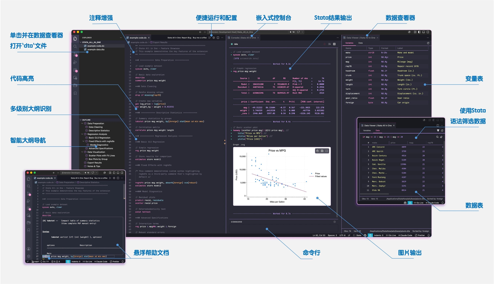

<!-- markdownlint-disable MD001 MD041 MD033 MD029 MD060 MD038 MD032 MD007 MD049-->

   

<h1 align="center">
Stata All in One
</h1>

   一个为 Stata 用户量身打造的 <b>VS Code</b> 扩展

   | <b>版本:</b><a href="https://github.com/ZihaoVistonWang/stata-all-in-one/releases"> 0.3.1</a> | <b>作者:</b> <a href="https://zihaowang.cn">王梓豪</a> | <b>Translate:</b>
  <a href="https://github.com/ZihaoVistonWang/stata-all-in-one">English Version</a> |

---

<h3 align="center">一站式 Stata 体验： 运行代码 + 语法高亮 + 代码提示 + 智能大纲 + 数据查看 + AI Skill，<b>All in One</b>!</h3>

<h3 align="center"><b>开箱即用！</b> 所有功能均原生集成于 VS Code，无需额外配置 Python、Node.js 等任何第三方环境。</h3>

   
   
   
   

Stata All in One 源自 <a href="https://github.com/ZihaoVistonWang/stata-outline">Stata Outline</a>，进行了功能扩展和改进。

---

## 致谢

感谢小红书用户 **Rich\*\*d**、微信用户 **M\*k\***、**柿\*\*橙**、评论 “功能强大且配置简单的插件，谢谢！” 的匿名用户，以及 Buy me a coffee 用户 **LB\*\*PG@gmail.com**、**ol\*\*\*ba@gmail.com** 对本项目的支持。

感谢西北农林科技大学农林经济与管理创新团队为本人提供的科研支持、经费支持和对本项目的[宣传推广支持](https://mp.weixin.qq.com/s/kxSfIF2nu1LuUzC2NvKWog)。

感谢Stata官方授权经销商[北京友万信息科技有限公司（友万科技）](http://www.uone-tech.cn/)对本项目的[宣发支持](https://mp.weixin.qq.com/s/UhLmoGK4VhYULACagjbcTg)。

## 功能概览

   <a href="https://pan.zihaowang.cn/share/example-marked-cn.jpg"> 点击查看大图 </a>

> ⚠️ 以下标注 🔑 的功能需要`STATA.LIC`证书文件，请支持正版Stata软件以获得完整功能体验。您可以联系Stata Corp, LLC官方授权合作伙伴[北京友万信息科技有限公司(友万科技)](http://xhslink.com/o/QYWdYfrEhy)采购正版软件或申请试用。

### 1. AI Skill 功能（实验性）🔑

- **让 AI Agent 运行 Stata 代码**：<mark>扩展内置独立版原生 `stata-ai-skill`，让 Claude Code、Cursor、Codex CLI、Open Code、OpenClaw 等 AI 编程工具通过 Rust 后台服务运行 Stata。</mark>
- **原生本地服务**：<mark>AI Skill 服务由打包好的原生二进制运行，默认使用 `http://127.0.0.1:19522`。</mark>
- **安装交给 AI 就行**：<mark>点击编辑器工具栏的 `AI` 按钮，复制提示词粘贴到 AI 工具即可，AI 将从本扩展中安装或注册内置的 `stata-ai-skill`。</mark>
- **内置原生二进制**：<mark>随扩展提供 macOS Apple Silicon、Windows x64/ARM64 可执行文件，以及完整的 `SKILL.md` 运行指南。</mark>

### 2. 代码运行 (Stata 交互)

- **平台支持**：无需额外扩展即可与 **macOS** 和 **Windows** 上的 Stata 无缝集成。
- **两种运行模式**：
  - **嵌入式控制台**（默认模式）🔑：<mark>现在可以在 VS Code 内直接运行并展示Stata输出啦！包括*命令结果*、*错误信息*、*命令行窗口*和*图形输出*，真正实现 IDE 一体化体验。</mark>
  - **外部应用**：继续支持传统的通过 Stata 窗口运行代码的方式，适合喜欢使用 Stata 原生界面的用户。<mark>Windows端现在使用[Stata COM自动化](https://www.stata.com/automation/)，性能相比之前基于 PowerShell 的实现有显著提升。</mark>
- **多场景执行策略**：
  - **章节运行**：当光标在标题行（如 `** # 标题`）时，点击 ▶️ 按钮 或按 `Ctrl/Cmd + D`，将执行从该标题起始至下一个同级或高级别标题前的所有代码（即整个章节）。
  - **单行运行**：当光标在普通代码行（选中）时，点击 ▶️ 按钮 或按 `Ctrl/Cmd + D`，只执行当前行代码。
  - **选中运行**：当选中多行代码时，点击 ▶️ 按钮 或按 `Ctrl/Cmd + D`，执行选中行的代码。支持**模糊选中**——无需精确选中代码段的*首行*或*尾行*，系统会自动捕捉并运行选中内容涉及的全部行。

### 3. 增强语法高亮与代码提示

- **完整语法高亮和代码提示支持**：集成 [Stata Enhanced](https://github.com/kylebarron/language-stata) 语法引擎[^1]，为 `.do` 文件提供精确的语法高亮和代码提示（遵循 [MIT](https://gitee.com/ZihaoVistonWang/stata-all-in-one/blob/main/THIRD_PARTY_NOTICES.md) 许可）。
- **自定义命令高亮**：支持为用户常用的第三方命令（如 `reghdfe`、`ivreghdfe`、`gtools` 等）添加关键字高亮，可在设置中自由配置。
- **数据集变量名自动补全**：<mark>（运行一次代码后）在编辑器和控制台中输入变量名时，提供基于当前数据集的智能补全建议，提升编码效率。</mark>

[^1]: [Stata Enhanced](https://github.com/kylebarron/language-stata) 语法引擎由 Kyle Barron 开发，提供了对 Stata 语言的全面支持。本拓展遵循 [MIT](https://gitee.com/ZihaoVistonWang/stata-all-in-one/blob/main/THIRD_PARTY_NOTICES.md) 许可协议，感谢 Kyle Barron 的贡献！

### 4. 智能大纲与结构导航

- **多级大纲识别**：自动识别 `**#` 至 `**######` 格式的注释行，最高支持 _6 级层级标题_。
  - **快捷键**：`Ctrl/Cmd + 1-6` 快速转换对应等级标题，`Ctrl/Cmd + 0` 恢复为普通代码行。
- **光标自动跟随**：编辑器光标移动时，大纲视图将自动高亮并跳转至对应章节。
  - _设置方法：点击大纲右上角 `···` 按钮，勾选「跟随光标」。_[^2]
- **多级逻辑序号**：支持在大纲中显示 `1.1`、`1.2.1` 等格式的序号（需在设置中开启）。
- **自动同步序号**：插件会根据大纲结构自动在 `.do` 文件中插入或删除序号（需在设置中开启）。
- **支持`program define`块**：在大纲视图中显示 program 名称，方便导航和管理自定义程序。

[^2]: 抱歉～此为VS Code的GUI设置，我无法通过插件控制它。

### 5. 数据查看器🔑

- **即点即看**：<mark>点击Vs Code资源管理器中的 `.dta` 文件，即可在全新的 `数据查看器` 面板中打开数据集。</mark>
  - **变量信息**：变量表格显示变量名称、标签、类型等元数据。
  - **数据浏览**：支持行列动态加载，无需打开Stata，现在在Vs Code中就能轻松浏览大数据集。
- **跑完就看**：<mark>跑完代码后，可以立即在`控制台`面板中的`数据查看器`中查看上述结果。两种运行模式下均可使用，无需来回切换。</mark>
- **数据过滤**：<mark>提供 Stata 风格的列过滤功能，支持快速定位感兴趣的数据子集。</mark>
- **内置 `br` / `browse`**：<mark>在嵌入式控制台模式下，无论从代码编辑器还是 Console 命令输入框运行 `br` 或 `browse`，都会直接打开内置数据查看器；命令和本地化打开提示会保留在 Console 中，后续的 `varlist`、`if`、`in` 和 `nolabel` 会直接应用为查看器筛选条件。外部 Stata 模式不做拦截，保留 Stata 原有的 `br` / `browse` 行为。</mark>

### 6. 高效分隔线与样式

- **快速插入**：支持多种符号，显著提升代码的可读性。
  - **标准分隔符**：通过 `Ctrl/Cmd + [符号]` 快速插入分隔线：
    - `Ctrl/Cmd + -` (短横线) | `Ctrl/Cmd + =` (等号) | `Ctrl/Cmd + Shift + 8` (星号)
  - **自定义分隔符**：
    - `Ctrl + Alt + S` (Windows) | `Ctrl + Cmd + S` (macOS)，此处 **S** 代表 "**S**eparator"（分隔符）。
    - 按下快捷键后，输入你想要的字符即可生成对应的分隔线。
- **智能包裹模式**：
  - **空行插入**：生成完整宽度的分隔线（长度可在设置中调整）。
  - **非空行插入**：初次按快捷键在行上方插入，再次按键则在下方插入，实现“包裹”效果。
  - **标题修饰**：选中标题的若干字符按快捷键，将生成带有平衡装饰符的标题（例如：`**# === 标题内容 ===`），且不影响大纲识别。
    - 标题居中：如果使用 **标题修饰** + **自定义*空格*分隔符**，则标题内容将自动居中显示。

### 7. 更多精彩

1. 优化嵌入式控制台🔑
   - **图片输出**
     - **直接显示**：<mark>在嵌入式控制台中直接渲染 Stata 图形输出。</mark>
     - **导出选项**：<mark>支持将图形保存为SVG、PNG（可配置 DPI）或复制到剪贴板。</mark>
     - **全屏查看**：<mark>点击图形可在全屏模式下查看细节。</mark>

   - **进度显示**
     - **命令执行状态**：<mark>对于`bootstrap`、`bdiff`、`xthreg`等耗时命令，控制台会显示实时进度（如 50/2000）和预计剩余时间。其他命令会显示运行耗时。</mark>

   - **自定义字体**：
     - **设置字体**：<mark>通过 `stata-all-in-one.consoleFontMode` 和 `stata-all-in-one.consoleCustomFontFamily` 设置项，用户可以自定义控制台的字体，以获得更好的阅读体验。</mark>

2. 注释增强
   - **一键切换**：使用 `Ctrl/Cmd + /` 快速切换行注释状态。
   - **可选样式**：默认使用 `//`，支持在设置中更改为其他合法注释符。

3. 内置帮助
   - **输出帮助文本**：例如：选中 `regress`，按下快捷键`Ctrl/Cmd + Shift + H`，外部应用（externalApp）模式会打开 Stata 的 `regress` 帮助页面，<mark>而嵌入式控制台（embeddedConsole）模式则会在控制台中直接显示 `regress` 的帮助文本。</mark>
   - **悬浮帮助提示**：<mark>鼠标悬停在 Stata 命令上时显示帮助信息，并自动过滤掉一些非实用命令（如 `#delimit`、`using` 等）。</mark>

4. 智能换行
   - **一键换行**：使用 `Shift+Enter` 在光标位置插入 Stata 换行符 `///`。
   - **智能缩进**：自动缩进 4 个空格

5. 安全重命名模式
   - **重命名**：选中变量，按 `F2` 键可重命名当前文档中的所有该变量。
   - **智能验证**：自动验证新名称是否符合 Stata 命名规则，并检查是否与内置命令或关键字冲突。
   - **命令保护**：智能识别并阻止重命名 Stata 命令（如 `reghdfe`、`outreg2`）及其选项（如 `absorb`、`ctitle`）。

6. 自动 `cd` 到 do 文件目录
   - **自动设置工作目录**：开启后，Stata 首次启动时会自动将工作目录切换到当前 do 文件所在位置。
   <!-- - **默认关闭**：为避免影响习惯在 do 文件开头手动写 `cd` 命令的用户，防止产生意料之外的错误，该功能默认不启用。需要时可在设置中开启 `stata-all-in-one.cdToDoFileDir`。 -->

7. 快速设置
   - **设置按钮**：<mark>点击编辑器标题栏的齿轮图标，快速访问 Stata All in One 的相关设置。</mark>

---

## 快捷键

点击[这里](https://gitee.com/ZihaoVistonWang/stata-all-in-one/blob/main/SHORTCUT.md)查看完整快捷键列表。

---

## 安装

### 从扩展市场安装

- **VS Code**: 在扩展中搜索 "Stata All in One" 并安装。

### 下载安装（适用于 Cursor、Trae 等基于 VSCode 的 IDE）

1. 从以下任一来源下载 `stata-all-in-one-x.x.x.vsix`：
   - [Open VSX Registry](https://open-vsx.org/extension/ZihaoVistonWang/stata-all-in-one)
   - [GitHub 发布页面](https://github.com/ZihaoVistonWang/stata-all-in-one/releases)
2. 在编辑器中打开扩展面板 → `...` → `从 VSIX 安装...`。
3. 选择下载的 `.vsix` 文件完成安装。

---

## 配置

在 VS Code 设置中搜索 "Stata All in One"，配置以下选项：

### AI Skill

点击 Stata 编辑器工具栏中的 `AI` 按钮，可复制一段提示词，指导你的 AI 编程工具安装或注册扩展内置的原生 `stata-ai-skill`。独立服务默认使用 `http://127.0.0.1:19522`，并通过内置的 `skill/SKILL.md` 配置。

### 代码运行

1. <mark>**运行模式** (`stata-all-in-one.runMode`)</mark>
   - `embeddedConsole`（默认）：在 VS Code 内置的 **控制台 | Stata All in One** 面板中运行代码，直接查看输出并交互。
   - `externalApp`：将代码发送到系统安装的外部 Stata 应用执行。

4. **Stata 版本（macOS）** (`stata-all-in-one.stataVersionOnMacOS`)
   - Stata 运行版本。配置为空时，扩展会在启动时自动探测，最长等待 3 秒；优先数字版本最高的安装，同版本按 `StataMP`、`StataSE`、`StataBE`、`StataIC` 排序。未找到时会弹出版本选择框。启动初始化随后检查准确的 `.app` 路径、Console dylib 和 `stata.lic`，尽可能初始化内置控制台，并通过中心弹窗只汇报一次结果。

5. **Stata 路径（Windows）** (`stata-all-in-one.stataPathOnWindows`)
   - Stata 执行文件路径（例如 `C:\Program Files\Stata17\StataMP-64.exe`）。配置为空时，扩展会在启动时运行内置的 `scripts/discover_stata_windows.bat` 注册表探测脚本，最长等待 5 秒。该 BAT 也可独立运行并生成 `stata-discovery-report.json`，用于问题排查。未找到时会弹出 EXE 路径输入框并验证所选文件。启动初始化随后检查 EXE、Console DLL 和 `stata.lic`，尽可能初始化内置控制台，并通过中心弹窗只汇报一次结果。

6. **发送代码前关闭 Stata 其他窗口（Windows）** (`stata-all-in-one.closeStataOtherWindowsBeforeSendingCode`)
   - `true`：发送运行命令前先关闭 Stata 辅助窗口（如 Viewer、Data Editor）。
   - `false`（默认）：保留这些窗口，直接发送代码。

7. **自动 cd 到 do 文件目录** (`stata-all-in-one.cdToDoFileDir`)
   - `true`（默认）：Stata 首次启动时自动将工作目录切换到当前 do 文件所在位置。
   - `false`：Stata 启动后不更改工作目录。

8. **显示操作按钮** (`stata-all-in-one.showActionButtons`)
   - `true`（默认）：在编辑器标题栏显示“Bug 反馈”和“Stata AI Skill”按钮。
   - `false`：隐藏这两个按钮。

9. **显示打赏支持按钮** (`stata-all-in-one.showSponsorButton`)
   - `true`：在 Stata 编辑器标题栏显示“打赏支持”按钮。
   - `false`（默认）：隐藏该按钮。

10. **启用 Ctrl+Shift+D 作为运行快捷键** (`stata-all-in-one.enableCtrlShiftD`)
   - `true`：使用 `Ctrl/Cmd+Shift+D` 作为运行代码的快捷键。
   - `false`（默认）：使用默认的 `Ctrl/Cmd+D` 快捷键。

### 嵌入式控制台

11. <mark>**控制台字体模式** (`stata-all-in-one.consoleFontMode`)</mark>
   - `online`（默认）：为西文加载 Maple Mono，为 CJK 文本加载 Maple Mono NF CN。
   - `editor`：跟随编辑器字体，降级到系统等宽字体。
   - `system`：直接使用系统等宽字体。
   - `custom`：使用下方自定义字体设置。
   - 字体致谢：[subframe7536/maple-font](https://github.com/subframe7536/maple-font)、[fontsource](https://fontsource.org/fonts/maple-mono) 和 ZeoSeven Fonts（[443](https://fonts.zeoseven.com/items/443/)、[442](https://fonts.zeoseven.com/items/442/)）。

12. <mark>**控制台自定义字体** (`stata-all-in-one.consoleCustomFontFamily`)</mark>
    - 当字体模式设为 `custom` 时，控制台使用的 CSS `font-family` 列表。
    - 示例：`"Maple Mono NF CN", Menlo, Monaco, monospace`

13. <mark>**图形导出 DPI** (`stata-all-in-one.graphPngDpi`)</mark>
    - 嵌入式控制台图形保存为 PNG 时的 DPI 值。默认 `600`，范围 72–1200。

### 语法高亮和代码提示

14. **自定义命令高亮** (`stata-all-in-one.customCommands`)
    - 自定义需要高亮的 Stata 命令（字符串数组），默认包含 `reghdfe`。
    - 示例：`["reghdfe", "ivreghdfe", "gtools", "winsor2", "outreg2"]`
    - **配置后需要重载窗口生效**。

### Hover 悬停帮助

15. <mark>**启用悬停文档** (`stata-all-in-one.enableHoverDocs`)</mark>
    - `true`（默认）：鼠标悬停在 Stata 命令上时显示官方帮助信息。
    - `false`：关闭悬停帮助。

16. <mark>**额外 ADO 路径** (`stata-all-in-one.additionalAdoPaths`)</mark>
    - 用于扫描社区贡献命令帮助文件的额外 Stata ADO 路径。
    - 示例：`["/Users/username/ado/personal", "C:\\Users\\username\\ado\\personal"]`

### 大纲与导航

17. **显示多级序号** (`stata-all-in-one.numberingShow`)
    - `true`：大纲显示 `1.1`、`1.2.1` 等序号。
    - `false`（默认）：显示原始标题。

18. **自动添加标题序号** (`stata-all-in-one.numberingAdd`)
    - `true`：**当启用序号时**，自动更新 `.do` 文件中的 section 标题以包含序号。
    - `false`（默认）：仅大纲显示序号，不修改文件。

> **注意**：修改 `numberingShow`、`numberingAdd`、`customCommands` 设置后需重新打开 `.do` 文件生效。禁用 `numberingAdd` 时，文件中现有序号将被自动移除。

### 代码风格

19. **注释样式** (`stata-all-in-one.commentStyle`)
    - `// `（默认）：用于切换注释的样式。选项包括 `//`、`*` 或 `/* ... */`

20. **分隔线长度** (`stata-all-in-one.separatorLength`)
    - 分割线所在行的字符总长度（包括前缀 `** #` 和分隔符）。默认值：`60`

21. **分隔线对称性** (`stata-all-in-one.separatorSymmetric`)
    - `true`：在分割线末尾添加 ` **` 以保证视觉对称（例如 `** === 标题 === **`）。
    - `false`（默认）：分割线不添加末尾后缀。

---

## 项目支持

如果这个扩展对你有帮助，欢迎扫描下方的 **支付宝**（左）、**微信**（中）或 [**Buy me a Coffee**](https://www.buymeacoffee.com/zihaovistonwang)（右）二维码，感谢支持 ☕

   

---

## 版本记录

| 版本   | 更新内容                                                                           | 发布日期   |
| ------ | ---------------------------------------------------------------------------------- | ---------- |
| 0.3.1 | 优化 Stata 初始化配置流程，自动完成安装探测与运行环境检查，尽可能减少用户手动配置的情况 | 2026-07-13 |
| 0.3.0 | 正式版：修复预览版中的已知问题 | 2026-07-06 |
| 0.2.19 | 内置独立原生 `stata-ai-skill`；修复 macOS Console 继承 Stata Python 配置；优化 Stata 编辑器操作按钮 | 2026-06-18 |
| 0.2.18 | 预览版：修复 Windows 嵌入式控制台初始化失败；新增 STATA.LIC 证书检测与弹窗提示；修复 webview Service Worker 注册错误；优化命令行输入框样式；修复 AI Skill 多行代码执行问题 | 2026-06-07 |
| 0.2.17-0.2.14 | 预览版：引入 AI Skill、嵌入式控制台、数据查看器和图形支持等核心功能；优化 Hover 帮助显示；修复已知问题 | 2026-05-31 |
| 0.2.13 | Windows 下运行代码时，不再把已贴靠或最大化 的 Stata 窗口还原成更小的普通窗口，现会保持 Stata 当前窗口大小不变 | 2026-03-12 |
| 0.2.12 | 重构 Windows 端代码执行逻辑；新增配置：发送代码前可选关闭 Viewer、数据编辑器等辅助窗口；新增配置：是否显示“Bug 反馈”和“项目支持”按钮 | 2026-03-05 |
| 0.2.11 | 新增可选配置：Stata 首次启动时自动 `cd` 到 do 文件所在目录（默认关闭）             | 2026-03-02 |
| 0.2.10 | 优化代码运行逻辑（章节/单行/选中运行）；新增运行快捷键可选；新增 F2 变量重命名功能 | 2026-02-27 |

详见 [CHANGELOG.md](CHANGELOG.md) 完整版本记录。
