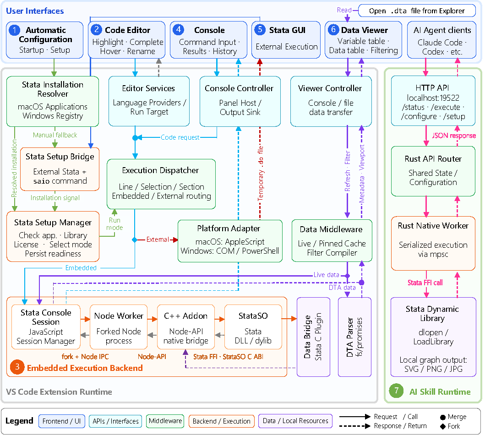

# Architecture and Technical Implementation

[Figure 1](#fig-architecture) presents the main components and technical routes of Stata All in One (SAiO).For clarity, the architecture is intentionally simplified and abstracted, and some labels represent logical components rather than one-to-one mappings to individual source modules. The complete implementation is available in the project repository on GitHub.

  

Figure 1. Architecture and technical routes of SAiO

SAiO combines several technologies according to the roles of its components. Most coordination logic is written in JavaScript and runs in the VS Code Extension Runtime. The Code Editor uses VS Code Language APIs and TextMate grammars, while the Console and Data Viewer use HTML-based Webview panels. Inspired by PyStata's ability to invoke Stata from another programming environment, embedded execution connects VS Code to the native Stata runtime through a forked `Node.js` worker process and a C++ `Node-API` bridge, without requiring a Python or PyStata environment. External execution instead controls the Stata desktop application through platform-specific interfaces. The AI Skill is implemented in Rust and communicates with AI agents through local `HTTP` and `JSON`. The C++ `Node-API` bridge used for embedded execution and the Rust executable used by the AI Skill are distributed as precompiled binaries for supported platforms, eliminating the need for users to install the corresponding build toolchains or compile these components locally.

The route begins with **Automatic Configuration**, a critical step in ensuring that users can access the environment without unnecessary configuration barriers. The Stata Installation Resolver searches for installed Stata versions in the standard Applications directories on macOS or in the Windows Registry and presents the detected installations to the user. The Stata Setup Manager then validates the selected application, dynamic library, and license and determines the available execution mode. If automatic discovery fails, the Stata Setup Bridge provides a fallback: the bundled `saio` command is run in Stata and returns installation information to a temporary local configuration service. Both routes ultimately produce the same persisted Stata configuration.

The **Code Editor** is the native VS Code editor. Editor Services provide syntax highlighting, completion, hover information, variable renaming, and structured navigation. Comments beginning with `**#` through `**######` are interpreted as hierarchical sections and exposed through the VS Code Outline. The same structure is used to determine execution targets, including the current line, selection, section, or entire file. These targets are passed to the Execution Dispatcher, which selects one of two parallel execution routes.

In the primary embedded route, code is sent to the **Embedded Execution Backend**. A JavaScript Stata Console Session communicates through `Node.js IPC` with a forked `Node.js` worker, which loads the precompiled C++ `Node-API` addon. The addon dynamically loads the platform-specific Stata library—a `DLL` on Windows or a `dylib` on macOS—and calls Stata through the native `StataSO` C interface. The same Stata session is retained across commands, allowing data, macros, programs, and estimation results to persist between executions. Output returns through the same chain to the **Console**, a VS Code Webview providing command input, streaming results, history, graph display, file links, and execution controls.

Alternatively, the dispatcher can route execution to the **Stata GUI**, the local Stata desktop application. In this external-application route, submitted code is written to a temporary `.do` file and passed to Stata. macOS uses `AppleScript`, whereas Windows primarily uses Stata Automation through `COM`, with a `PowerShell`-based fallback. Execution and result presentation remain in the external Stata application. The two modes therefore share the same editor-side execution logic but differ in where the Stata session and results are presented.

The **Data Viewer** supports two data routes. Local `.dta` files opened from the VS Code Explorer are parsed directly by the built-in DTA Parser and do not require a running Stata session. For data held in the embedded session, a Stata C plugin acts as the Data Bridge and reads the in-memory dataset through the Stata Plugin API. Both sources pass through common data middleware for metadata, filtering, caching, and viewport management before being displayed in the same Webview interface.

Finally, the **AI Skill** provides an independent route for agent-assisted Stata work. AI agents such as Claude Code or Codex communicate with the local Rust service through `HTTP` and `JSON`. The service maintains its own configuration and a native worker that processes requests serially, dynamically calls the Stata library through `FFI`, and returns Stata output, return codes, errors, and graph files to the agent. Although its runtime is independent of the VS Code extension, the AI Skill remains part of the same productivity environment by enabling executable and verifiable Stata interaction in agent workflows.

Taken together, these components connect configuration, editing, execution, inspection, and agent interaction around the native Stata runtime. SAiO thereby provides an integrated VS Code-based environment while retaining compatibility with the conventional external Stata application.
