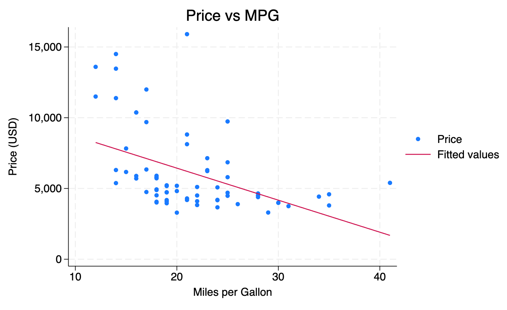

This result file was exported by [Stata All in One](https://marketplace.visualstudio.com/items?itemName=ZihaoVistonWang.stata-all-in-one).

> ```stata
> ** ==================================================
> // Stata All in One - Feature Showcase
> ** ==================================================
> 
> **# Data Preparation
> // Load example dataset
> sysuse auto, clear
> 
> // Basic data exploration
> describe
> summarize price mpg weight, detail
> 
> **## Data Cleaning
> // Handle missing values
> drop if missing(rep78)
> 
> // Create new variables
> gen log_price = log(price)
> gen weight_kg = weight * 0.453592
> 
> **## Descriptive Statistics
> // Summary statistics by groups
> tabstat price mpg weight, by(foreign) stat(mean sd min max)
> 
> // Correlation matrix
> correlate price mpg weight length
> 
> **# Regression Analysis
> **## Basic OLS Regression
> 
> // Simple regression
> reg price mpg weight
> 
> // Store results for comparison
> estimates store model1
> 
> **## Fixed Effects with reghdfe
> /* This command demonstrates custom syntax highlighting
>    reghdfe is a third-party command that's highlighted by default */
>    
> reghdfe price mpg weight, absorb(foreign) vce(robust)
> estimates store model2
> 
> **# Data Visualization
> **## Scatter Plots with Fit Lines
> twoway (scatter price mpg) (lfit price mpg), ///
> 	title("Price vs MPG") ///
> 	xtitle("Miles per Gallon") ///
> 	ytitle("Price (USD)")
> 
> 
> **# Export Results
> 
> // Export summary table
> eststo clear
> eststo: quietly reg price mpg weight
> eststo: quietly reg price mpg weight, robust
> esttab using "results.csv", replace csv
> 
> // Save cleaned dataset
> save "auto_cleaned.dta", replace
> 
> **# Notes & Tips
> 
> /* Feature Highlights:
>    1. Use Ctrl/Cmd + 1-6 to set heading levels
>    2. Press Ctrl/Cmd + D to run current section
>    3. Use Ctrl/Cmd + / to toggle comments
>    4. Try Ctrl/Cmd + = to insert separator lines
>    5. Custom commands like 'reghdfe' are highlighted automatically
>    
>    Navigation Tips:
>    - Click on any section in the Outline panel to jump there
>    - Enable "Follow Cursor" in Outline view for auto-sync
>    - Use numbering in settings for hierarchical structure
> */
> 
> // End of demonstration file
> ```

```text

. ** ==================================================
. // Stata All in One - Feature Showcase
. ** ==================================================
. 
. **# Data Preparation
. // Load example dataset
. sysuse auto, clear
(1978 automobile data)

. 
. // Basic data exploration
. describe

Contains data from /Applications/StataNow/ado/base/a/auto.dta
 Observations:            74                  1978 automobile data
    Variables:            12                  13 Apr 2024 17:45
                                              (_dta has notes)
----------------------------------------------------------------------------------------
Variable      Storage   Display    Value
    name         type    format    label      Variable label
----------------------------------------------------------------------------------------
make            str18   %-18s                 Make and model
price           int     %8.0gc                Price
mpg             int     %8.0g                 Mileage (mpg)
rep78           int     %8.0g                 Repair record 1978
headroom        float   %6.1f                 Headroom (in.)
trunk           int     %8.0g                 Trunk space (cu. ft.)
weight          int     %8.0gc                Weight (lbs.)
length          int     %8.0g                 Length (in.)
turn            int     %8.0g                 Turn circle (ft.)
displacement    int     %8.0g                 Displacement (cu. in.)
gear_ratio      float   %6.2f                 Gear ratio
foreign         byte    %8.0g      origin     Car origin
----------------------------------------------------------------------------------------
Sorted by: foreign

. summarize price mpg weight, detail

                            Price
-------------------------------------------------------------
      Percentiles      Smallest
 1%         3291           3291
 5%         3748           3299
10%         3895           3667       Obs                  74
25%         4195           3748       Sum of wgt.          74

50%       5006.5                      Mean           6165.257
                        Largest       Std. dev.      2949.496
75%         6342          13466
90%        11385          13594       Variance        8699526
95%        13466          14500       Skewness       1.653434
99%        15906          15906       Kurtosis       4.819188

                        Mileage (mpg)
-------------------------------------------------------------
      Percentiles      Smallest
 1%           12             12
 5%           14             12
10%           14             14       Obs                  74
25%           18             14       Sum of wgt.          74

50%           20                      Mean            21.2973
                        Largest       Std. dev.      5.785503
75%           25             34
90%           29             35       Variance       33.47205
95%           34             35       Skewness       .9487176
99%           41             41       Kurtosis       3.975005

                        Weight (lbs.)
-------------------------------------------------------------
      Percentiles      Smallest
 1%         1760           1760
 5%         1830           1800
10%         2020           1800       Obs                  74
25%         2240           1830       Sum of wgt.          74

50%         3190                      Mean           3019.459
                        Largest       Std. dev.      777.1936
75%         3600           4290
90%         4060           4330       Variance       604029.8
95%         4290           4720       Skewness       .1481164
99%         4840           4840       Kurtosis       2.118403

. 
. **## Data Cleaning
. // Handle missing values
. drop if missing(rep78)
(5 observations deleted)

. 
. // Create new variables
. gen log_price = log(price)

. gen weight_kg = weight * 0.453592

. 
. **## Descriptive Statistics
. // Summary statistics by groups
. tabstat price mpg weight, by(foreign) stat(mean sd min max)

Summary statistics: Mean, SD, Min, Max
Group variable: foreign (Car origin)

 foreign |     price       mpg    weight
---------+------------------------------
Domestic |   6179.25  19.54167  3368.333
         |  3188.969  4.753312  688.0108
         |      3291        12      1800
         |     15906        34      4840
---------+------------------------------
 Foreign |  6070.143  25.28571  2263.333
         |  2220.984  6.309856  364.7099
         |      3748        17      1760
         |     11995        41      3170
---------+------------------------------
   Total |  6146.043  21.28986  3032.029
         |   2912.44  5.866408  792.8515
         |      3291        12      1760
         |     15906        41      4840
----------------------------------------

. 
. // Correlation matrix
. correlate price mpg weight length
(obs=69)

             |    price      mpg   weight   length
-------------+------------------------------------
       price |   1.0000
         mpg |  -0.4559   1.0000
      weight |   0.5478  -0.8055   1.0000
      length |   0.4425  -0.8037   0.9478   1.0000


. 
. **# Regression Analysis
. **## Basic OLS Regression
. 
. // Simple regression
. reg price mpg weight

      Source |       SS           df       MS      Number of obs   =        69
-------------+----------------------------------   F(2, 66)        =     14.19
       Model |   173465736         2    86732868   Prob > F        =    0.0000
    Residual |   403331223        66  6111079.13   R-squared       =    0.3007
-------------+----------------------------------   Adj R-squared   =    0.2795
       Total |   576796959        68  8482308.22   Root MSE        =    2472.1

------------------------------------------------------------------------------
       price | Coefficient  Std. err.      t    P>|t|     [95% conf. interval]
-------------+----------------------------------------------------------------
         mpg |   -20.7178   86.23695    -0.24   0.811    -192.8954    151.4598
      weight |   1.888939   .6380781     2.96   0.004     .6149747    3.162903
       _cons |   859.8055   3595.098     0.24   0.812    -6318.039     8037.65
------------------------------------------------------------------------------

. 
. // Store results for comparison
. estimates store model1

. 
. **## Fixed Effects with reghdfe
. /* This command demonstrates custom syntax highlighting
>    reghdfe is a third-party command that's highlighted by default */
.    
. reghdfe price mpg weight, absorb(foreign) vce(robust)
(MWFE estimator converged in 1 iterations)

HDFE Linear regression                            Number of obs   =         69
Absorbing 1 HDFE group                            F(   2,     65) =      19.50
                                                  Prob > F        =     0.0000
                                                  R-squared       =     0.4961
                                                  Adj R-squared   =     0.4729
                                                  Within R-sq.    =     0.4960
                                                  Root MSE        =  2114.5303

------------------------------------------------------------------------------
             |               Robust
       price | Coefficient  std. err.      t    P>|t|     [95% conf. interval]
-------------+----------------------------------------------------------------
         mpg |   34.34102   80.54482     0.43   0.671    -126.5181    195.2001
      weight |   3.606288   .8076414     4.47   0.000     1.993317    5.219259
       _cons |  -5519.441    3844.32    -1.44   0.156    -13197.08    2158.197
------------------------------------------------------------------------------

Absorbed degrees of freedom:
-----------------------------------------------------+
 Absorbed FE | Categories  - Redundant  = Num. Coefs |
-------------+---------------------------------------|
     foreign |         2           0           2     |
-----------------------------------------------------+

. estimates store model2

. 
. **# Data Visualization
. **## Scatter Plots with Fit Lines
. twoway (scatter price mpg) (lfit price mpg), ///
>         title("Price vs MPG") ///
>         xtitle("Miles per Gallon") ///
>         ytitle("Price (USD)")
. 
. 
. **# Export Results
. 
. // Export summary table
. eststo clear

. eststo: quietly reg price mpg weight
(est1 stored)

. eststo: quietly reg price mpg weight, robust
(est2 stored)

. esttab using "results.csv", replace csv
(file results.csv not found)
(output written to results.csv)

. 
. // Save cleaned dataset
. save "auto_cleaned.dta", replace
(file auto_cleaned.dta not found)
file auto_cleaned.dta saved

. 
. **# Notes & Tips
. 
. /* Feature Highlights:
>    1. Use Ctrl/Cmd + 1-6 to set heading levels
>    2. Press Ctrl/Cmd + D to run current section
>    3. Use Ctrl/Cmd + / to toggle comments
>    4. Try Ctrl/Cmd + = to insert separator lines
>    5. Custom commands like 'reghdfe' are highlighted automatically
>    
>    Navigation Tips:
>    - Click on any section in the Outline panel to jump there
>    - Enable "Follow Cursor" in Outline view for auto-sync
>    - Use numbering in settings for hierarchical structure
> */
. 
. // End of demonstration file
. 
end of do-file
```



*Worked for 1.3s*
